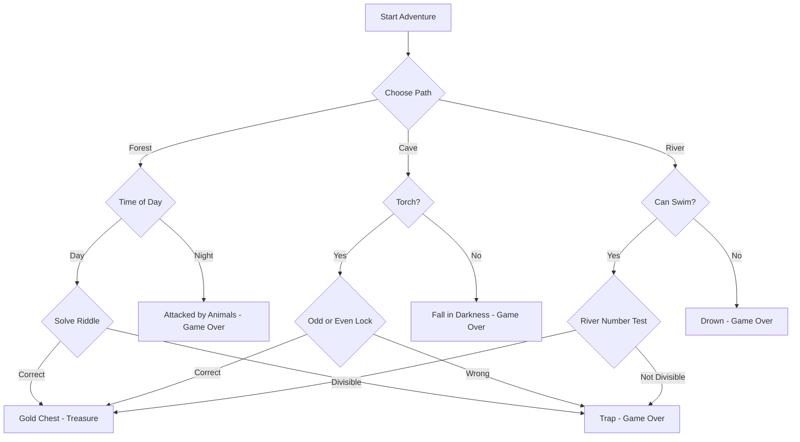

### CHOOSE YOUR ADVENTURE — TREASURE HUNT (Python)

---

## GAME CONCEPT

You are an explorer searching for a hidden treasure.
Every decision uses **conditional flow, logical operators, comparison operators, modulo, nesting, and error handling**.

Wrong decisions end the game.
Correct logical paths lead to treasure.

---

## FLOW CHART (MERMAID)



---

## GAME RULES USED

| Concept            | Usage                  |
| ------------------ | ---------------------- |
| `if / elif / else` | Story branching        |
| Logical operators  | Multi-condition checks |
| Modulo `%`         | Puzzles                |
| Nested `if`        | Dependent decisions    |
| Multiple `if`      | Validation             |
| Error handling     | Input safety           |
| Data types         | `str`, `int`, `bool`   |

---

## COMPLETE PYTHON GAME CODE

```python
def get_choice(prompt, choices):
    """
    Ensures user enters a valid option
    """
    while True:
        choice = input(prompt).strip().lower()
        if choice in choices:
            return choice
        print("Invalid choice. Try again.")


def forest_path():
    """
    Forest storyline using nested if and riddle logic
    """
    time = get_choice("Choose time (day/night): ", ["day", "night"])

    if time == "night":
        print("Wild animals attack you. Game Over.")
        return

    # Riddle using modulo
    print("Riddle: I am a number divisible by both 3 and 5.")
    try:
        num = int(input("Enter the number: "))
        if num % 3 == 0 and num % 5 == 0:
            print("Chest opens. You found the treasure! 🪙")
        else:
            print("Wrong answer. Trap triggered. Game Over.")
    except ValueError:
        print("Invalid number. Game Over.")


def cave_path():
    """
    Cave storyline using logical operators
    """
    torch = get_choice("Do you have a torch? (yes/no): ", ["yes", "no"])

    if torch == "no":
        print("You fall into darkness. Game Over.")
        return

    # Lock puzzle
    print("A lock asks: Is 14 even or odd?")
    answer = get_choice("Enter even/odd: ", ["even", "odd"])

    if 14 % 2 == 0 and answer == "even":
        print("Door opens. Treasure found! 💎")
    else:
        print("Wrong logic. Poison gas released. Game Over.")


def river_path():
    """
    River storyline using modulo and multiple conditions
    """
    swim = get_choice("Can you swim? (yes/no): ", ["yes", "no"])

    if swim == "no":
        print("You drown. Game Over.")
        return

    try:
        num = int(input("River stone has number 12. Is it divisible by 4? Enter yes/no: ").lower())
    except:
        pass

    answer = get_choice("Is 12 divisible by 4? (yes/no): ", ["yes", "no"])

    if 12 % 4 == 0 and answer == "yes":
        print("You cross safely. Treasure is yours! 🏆")
    else:
        print("Wrong calculation. Swept away. Game Over.")


def main():
    """
    Main game controller
    """
    print("WELCOME TO THE TREASURE HUNT")
    print("Choose your path wisely.\n")

    path = get_choice(
        "Choose a path (forest / cave / river): ",
        ["forest", "cave", "river"]
    )

    if path == "forest":
        forest_path()
    elif path == "cave":
        cave_path()
    else:
        river_path()


if __name__ == "__main__":
    main()
```

---

## KEY LEARNING POINTS (MAPPED TO GAME)

| Code Section   | Concept Applied             |
| -------------- | --------------------------- |
| `get_choice()` | Error handling + validation |
| Forest riddle  | `and`, `%`, nested `if`     |
| Cave lock      | Logical comparison          |
| River test     | Modulo reasoning            |
| Path choice    | `if-elif-else`              |
| Game endings   | Control flow termination    |

---

## PRACTICE EXTENSIONS

| Extension         | Concept                   |
| ----------------- | ------------------------- |
| Add health points | Arithmetic + conditionals |
| Add inventory     | Lists + logical checks    |
| Add time limit    | Loops                     |
| Add scoring       | Modulo + counters         |
| Add save system   | Files                     |

---

## WHY THIS IS PROFESSIONAL

* Clean modular functions
* Defensive input handling
* Real logic puzzles
* Readable conditions
* Industry-style flow control
* Interview-relevant concepts

This single game covers **everything you’ve learned so far** in a realistic, memorable way.
