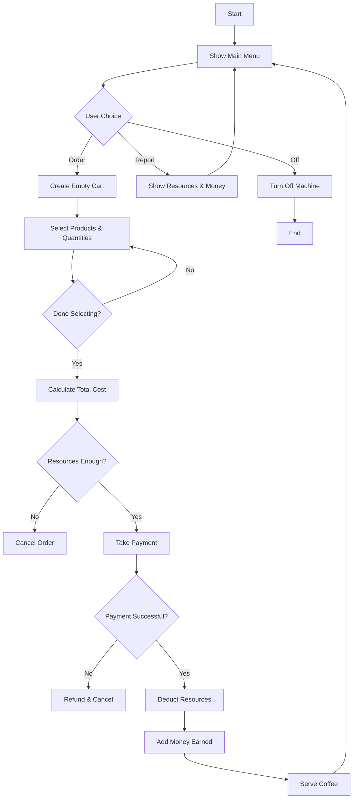

```text
ALGORITHM (HIGH-LEVEL OVERVIEW)

1. Initialize MENU, resources, coins, money_earned, machine_on
2. While machine_on is True:
   a. Display main menu (Order / Report / Off)
   b. If Order:
        i. Create empty cart
       ii. Allow user to add multiple products with quantities
      iii. Calculate total_cost
       iv. Check resources for entire cart
        v. If insufficient → cancel
       vi. Take payment once
      vii. If payment fails → refund
     viii. Deduct resources
       ix. Add money_earned
        x. Serve order
   c. If Report → display resources and money
   d. If Off → exit loop
3. End program
```

```text
PSEUDOCODE

START

SET MENU
SET resources
SET coins
SET money_earned = 0
SET machine_on = TRUE

WHILE machine_on IS TRUE
    DISPLAY main options
    GET user_choice

    IF user_choice == ORDER
        cart = empty
        total_cost = 0

        WHILE TRUE
            DISPLAY menu
            GET drink OR "done"
            IF drink == "done"
                BREAK
            IF drink NOT IN MENU
                DISPLAY error
                CONTINUE
            GET quantity
            ADD drink & quantity to cart
            UPDATE total_cost

        IF cart is empty
            CONTINUE loop

        IF resources NOT sufficient for cart
            DISPLAY missing ingredient
            CONTINUE loop

        TAKE payment(total_cost)
        IF payment failed
            CONTINUE loop

        DEDUCT resources using cart
        ADD total_cost to money_earned
        DISPLAY success

    ELSE IF user_choice == REPORT
        DISPLAY resources and money

    ELSE IF user_choice == OFF
        machine_on = FALSE

    ELSE
        DISPLAY invalid option

END WHILE

END
```



```text
FUNCTION + VARIABLE MAP + FILE TREE (COMBINED VIEW)

coffee_machine/
│
├── main.py
│
│   VARIABLES (GLOBAL STATE)
│   ├── MENU               -> dict : drink → ingredients + cost
│   ├── resources          -> dict : water, milk, coffee
│   ├── coins              -> dict : coin_name → value
│   ├── money_earned       -> int  : total revenue
│   ├── machine_on         -> bool : loop control
│
│   FUNCTIONS
│   ├── line()
│   │     Purpose: UI separator
│   │
│   ├── show_menu()
│   │     Purpose: display available drinks and prices
│   │
│   ├── check_resources(cart)
│   │     Input : cart {drink: quantity}
│   │     Output: (bool, missing_ingredient)
│   │     Role  : aggregate resource validation
│   │
│   ├── make_order(cart)
│   │     Input : cart
│   │     Role  : deduct resources after success
│   │
│   ├── take_payment(total_cost)
│   │     Input : total_cost
│   │     Output: (bool, amount_earned)
│   │     Role  : single consolidated payment handling
│
│   CONTROL FLOW
│   ├── while machine_on:
│   │     ├── order flow
│   │     ├── report flow
│   │     └── shutdown flow
│
└── (future extensions)
    ├── discounts.py
    ├── persistence.py
    └── coffee_machine_oop.py
```

This single structure gives you **design → logic → implementation → scalability** in one coherent mental model.
