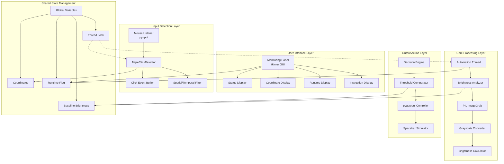
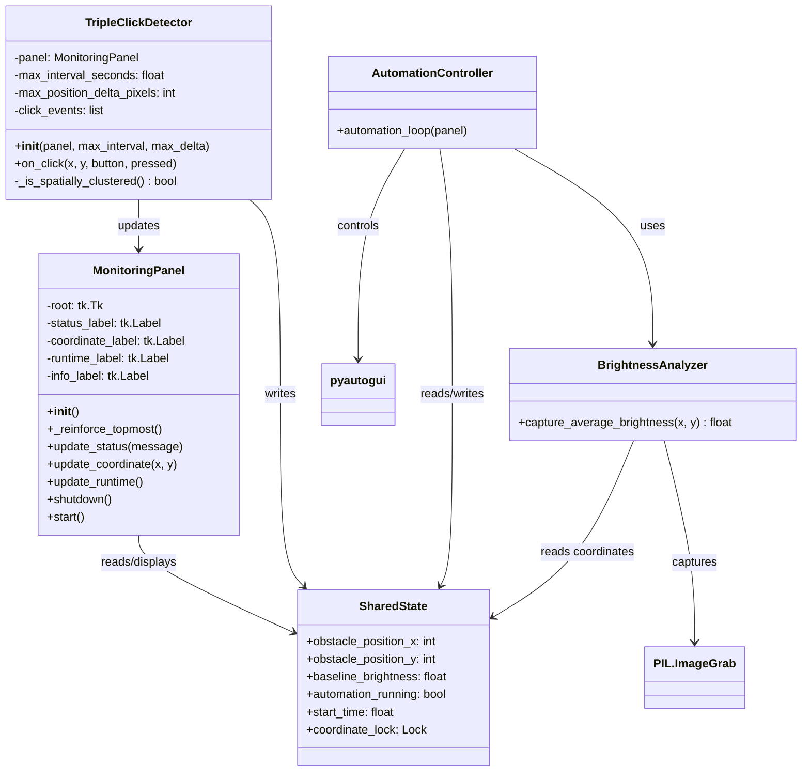
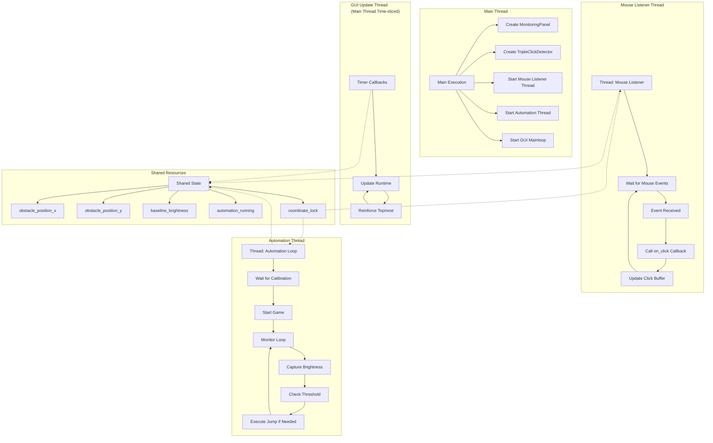
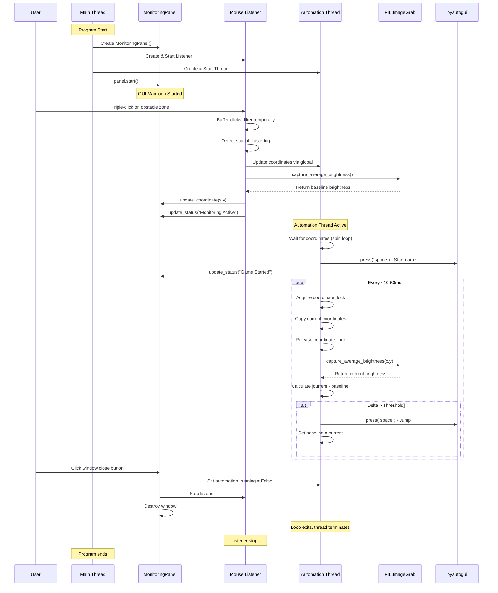
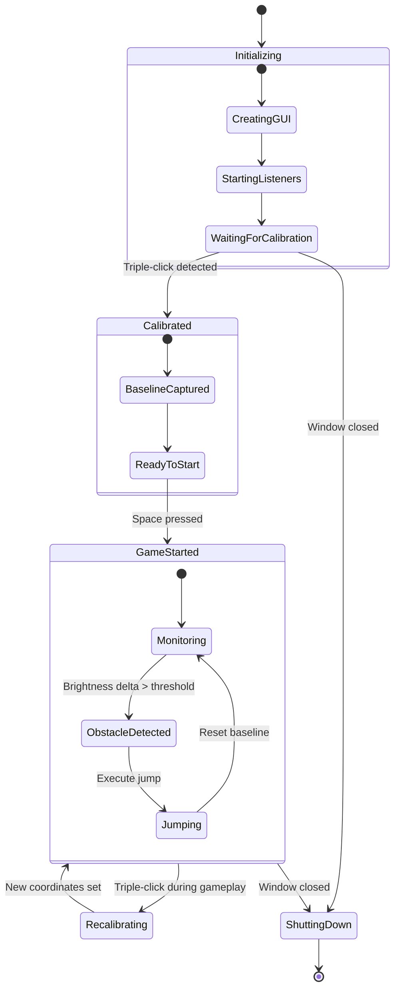

# Chrome T-Rex Automation System Documentation


## Adaptive Brightness-Change Detection Version

---

# Table of Contents

1. [System Overview](#system-overview)
2. [Architecture Design](#architecture-design)
3. [Component Hierarchy](#component-hierarchy)
4. [Data Flow Analysis](#data-flow-analysis)
5. [Threading Model](#threading-model)
6. [Detection Algorithm](#detection-algorithm)
7. [Function Reference](#function-reference)
8. [Variable Dictionary](#variable-dictionary)
9. [Execution Flow](#execution-flow)
10. [Configuration Parameters](#configuration-parameters)

---

# System Overview

The Chrome T-Rex Automation System is a computer vision-based automation tool designed to play the Chrome browser's offline dinosaur game. The system operates by monitoring a specific screen region for brightness changes that indicate approaching obstacles, then automatically triggering jump actions.

## Core Purpose

The system eliminates the need for manual gameplay by providing automated obstacle detection and response. Unlike traditional pixel-color based detectors, this implementation uses brightness delta detection which makes it theme-independent and more robust against visual variations.

## Key Features

- **Always-on-top Monitoring Panel**: Provides real-time status updates without being obscured by other windows
- **Runtime Triple-click Recalibration**: Allows users to dynamically reset detection coordinates during operation
- **Runtime Timer**: Tracks gameplay duration for performance monitoring
- **Brightness-delta Based Detection**: Uses luminance changes rather than specific colors for obstacle identification
- **Theme and Brightness Independence**: Works across different game themes and monitor brightness settings
- **Thread-safe Operations**: Ensures data consistency across concurrent execution paths
- **Graceful Shutdown**: Properly terminates all threads and releases resources on window close

---

# Architecture Design

## High-Level Architecture Diagram



## System Component Relationships



---

# Component Hierarchy

## 1. User Interface Component (MonitoringPanel)

The MonitoringPanel class provides visual feedback and user interaction capabilities. It operates as a standalone tkinter window that maintains topmost positioning.

### Subcomponents:
- **Window Manager**: Handles window geometry, positioning, and topmost enforcement
- **Label Controllers**: Manage four distinct information displays
- **Update Scheduler**: Coordinates periodic runtime updates
- **Shutdown Handler**: Manages graceful termination procedures

### Responsibilities:
- Display current obstacle detection coordinates
- Show system status (calibration, monitoring, game started)
- Track and display elapsed runtime
- Provide user instructions for recalibration
- Handle window close events for clean shutdown
- Maintain visibility through periodic topmost reinforcement

## 2. Input Detection Component (TripleClickDetector)

The TripleClickDetector monitors global mouse events and identifies triple-click patterns for recalibration.

### Subcomponents:
- **Click Event Buffer**: Maintains rolling window of recent clicks with timestamps
- **Temporal Filter**: Removes clicks older than the maximum interval
- **Spatial Analyzer**: Determines if clicks are clustered within pixel tolerance
- **Calibration Trigger**: Updates global coordinates when valid triple-click detected

### Responsibilities:
- Listen to global mouse events regardless of application focus
- Maintain temporal history of click events
- Filter out stale click events
- Validate spatial clustering of triple clicks
- Trigger coordinate recalibration
- Initiate baseline brightness capture after recalibration

## 3. Brightness Analysis Component

The brightness analysis functionality is implemented as a standalone function that interfaces with the PIL library.

### Subcomponents:
- **Region Capturer**: Defines and captures screen region using ImageGrab
- **Grayscale Converter**: Transforms RGB image to luminance values
- **Statistical Analyzer**: Computes mean brightness from pixel array

### Responsibilities:
- Define detection region based on current coordinates
- Capture screen region at high speed
- Convert to grayscale for luminance analysis
- Calculate average brightness value
- Return normalized brightness metric

## 4. Automation Controller Component

The automation controller runs as a background thread and implements the core detection and response logic.

### Subcomponents:
- **Initialization Handler**: Waits for calibration, starts game
- **Monitoring Loop**: Continuously analyzes brightness
- **Threshold Comparator**: Evaluates brightness deltas against threshold
- **Action Executor**: Triggers jumps when obstacles detected
- **Baseline Manager**: Updates baseline after jumps to prevent retriggering

### Responsibilities:
- Wait for successful calibration
- Start game with initial spacebar press
- Continuously monitor detection region
- Compare brightness changes against threshold
- Execute jump commands when obstacles detected
- Reset baseline after each jump
- Respect automation_running flag for shutdown

## 5. Shared State Management

The shared state consists of global variables protected by threading locks to ensure data consistency.

### Components:
- **Coordinate Storage**: obstacle_position_x, obstacle_position_y
- **Brightness Reference**: baseline_brightness
- **Control Flags**: automation_running, start_time
- **Synchronization Primitive**: coordinate_lock

### Responsibilities:
- Maintain current detection coordinates
- Store reference brightness value
- Track system running state
- Record game start timestamp
- Ensure thread-safe access to shared variables

---

# Data Flow Analysis

## Primary Data Flow Diagram

```mermaid
flowchart TD
    Start([System Start]) --> Init[Initialize Components]
    Init --> GUI[Create Monitoring Panel]
    Init --> Mouse[Start Mouse Listener]
    Init --> Thread[Start Automation Thread]
    
    subgraph Calibration_Flow [Calibration Data Flow]
        Click[Mouse Click] --> Buffer[Add to Click Buffer]
        Buffer --> Filter[Apply Temporal Filter]
        Filter --> Count{3 Clicks?}
        Count -->|No| Wait[Wait for More Clicks]
        Wait --> Click
        
        Count -->|Yes| Spatial{Check Spatial<br/>Clustering}
        Spatial -->|No| Clear[Clear Buffer]
        Clear --> Click
        
        Spatial -->|Yes| Lock1[Acquire Thread Lock]
        Lock1 --> UpdateCoords[Update obstacle_position_x/y]
        UpdateCoords --> Capture[Capture Baseline Brightness]
        Capture --> Release1[Release Thread Lock]
        Release1 --> UpdateGUI[Update Panel Coordinates]
        UpdateGUI --> Notify[Print Confirmation]
    end
    
    subgraph Automation_Flow [Automation Data Flow]
        WaitCalib[Wait for Calibration] --> CheckCoord{Coordinates Set?}
        CheckCoord -->|No| WaitLoop[Sleep 10ms]
        WaitLoop --> CheckCoord
        
        CheckCoord -->|Yes| StartGame[Press Space]
        StartGame --> MonitorLoop[Start Monitoring Loop]
        
        MonitorLoop --> ReadCoords[Read Coordinates with Lock]
        ReadCoords --> CaptureBright[Capture Current Brightness]
        CaptureBright --> ComputeDelta[Calculate |current - baseline|]
        ComputeDelta --> Compare{Delta > Threshold?}
        
        Compare -->|No| Continue[Continue Monitoring]
        Continue --> MonitorLoop
        
        Compare -->|Yes| Jump[Press Space]
        Jump --> UpdateBaseline[Set baseline = current]
        UpdateBaseline --> MonitorLoop
    end
    
    subgraph UI_Update_Flow [UI Update Data Flow]
        Timer[1 Second Timer] --> ReadStart[Read start_time]
        ReadStart --> ComputeElapsed[Calculate Elapsed Time]
        ComputeElapsed --> UpdateRuntime[Update runtime_label]
        UpdateRuntime --> Schedule[Schedule Next Update]
        
        TripleClick[Triple Click Detected] --> UpdateCoordDisplay[Update coordinate_label]
        UpdateCoordDisplay --> UpdateStatus[Update status_label]
    end
    
    Calibration_Flow --> Automation_Flow
    Automation_Flow --> UI_Update_Flow
```

## Data Transformation Pipeline

```mermaid
flowchart LR
    subgraph Input [Input Data]
        I1[Screen Pixels<br/>RGB Values]
        I2[Mouse Events<br/>x, y, timestamp]
    end
    
    subgraph Transform1 [Transformation Layer 1]
        T1[ImageGrab.capture<br/>→ RGB Image]
        T2[Click Buffer<br/>→ Time-filtered Events]
    end
    
    subgraph Transform2 [Transformation Layer 2]
        T3[convert('L')<br/>→ Grayscale Array]
        T4[Spatial Analyzer<br/>→ Clustered Clicks]
    end
    
    subgraph Transform3 [Transformation Layer 3]
        T5[sum()/len()<br/>→ Average Brightness]
        T6[Coordinate Validator<br/>→ New Calibration Point]
    end
    
    subgraph Output [Output Data]
        O1[Brightness Delta<br/>Detection Signal]
        O2[pyautogui.press<br/>→ Spacebar Event]
        O3[GUI Labels<br/>→ Text Display]
    end
    
    I1 --> T1 --> T3 --> T5 --> O1
    O1 --> O2
    
    I2 --> T2 --> T4 --> T6 --> O3
    
    T5 -.-> Baseline[Baseline Storage]
    Baseline -.-> O1
```

---

# Threading Model

## Thread Architecture



## Thread Synchronization

The system implements thread synchronization using:

1. **Lock Acquisition Pattern**: 
   - Any thread modifying coordinates must acquire coordinate_lock
   - Reading threads may also acquire lock for consistent snapshots
   - Lock released immediately after operation to minimize blocking

2. **Thread-safe Variable Access**:
   - Write operations use `with coordinate_lock:` context manager
   - Read operations for critical decisions also use lock
   - Non-critical reads may access without lock for performance

3. **Shutdown Coordination**:
   - Main thread sets automation_running = False
   - Automation thread checks flag each iteration
   - Mouse listener continues until explicitly stopped
   - GUI thread continues until window destroyed

---

# Detection Algorithm

## Brightness Delta Detection Theory

The algorithm operates on the principle that obstacles (cacti, birds) in the Chrome T-Rex game create significant luminance changes when they enter the detection zone. Unlike color-based detection, brightness delta detection is resilient to:

- Theme changes (day/night mode)
- Monitor brightness/contrast adjustments
- Browser zoom levels
- Slight variations in obstacle colors

## Mathematical Model

For a detection region R defined by coordinates (x, y) with width w and height h:

Let B(t) = (1/|R|) * Σ(p ∈ R) luminance(p) at time t

The detection decision D(t) is:

D(t) = 1 if |B(t) - B₀| > τ, else 0

Where:
- B₀ = baseline brightness at calibration time
- τ = brightness_change_threshold (default 25)
- |R| = number of pixels in region (w * h)

## Algorithm Steps

1. **Calibration Phase**:
   - User triple-clicks on obstacle approach zone
   - System captures baseline brightness B₀
   - Region dimensions fixed at 80x40 pixels

2. **Monitoring Phase**:
   - Capture region R at current coordinates
   - Compute B(t) as mean grayscale value
   - Calculate Δ = |B(t) - B₀|
   - Compare Δ against τ

3. **Response Phase**:
   - If Δ > τ: Press space, set B₀ = B(t)
   - Else: Continue monitoring

4. **Baseline Reset**:
   - After each jump, B₀ updated to current brightness
   - Prevents repeated triggers from same obstacle
   - Adapts to gradual lighting changes

---

# Function Reference

## Global Functions

### `capture_average_brightness(x, y)`
**Purpose**: Captures screen region and calculates average luminance.

**Parameters**:
- `x` (int): X-coordinate of detection region center
- `y` (int): Y-coordinate of detection region center

**Returns**: `float` - Average brightness value (0-255)

**Algorithm**:
1. Define detection region: (x, y-20, x+80, y+20)
2. Capture screen region using PIL.ImageGrab
3. Convert to grayscale (L mode)
4. Extract pixel values as list
5. Calculate arithmetic mean

**Dependencies**: PIL.ImageGrab, global constants horizontal_scan_width, vertical_scan_half_height

---

### `automation_loop(panel)`
**Purpose**: Main automation thread function that monitors brightness and triggers jumps.

**Parameters**:
- `panel` (MonitoringPanel): Reference to GUI panel for status updates

**Global Variables Modified**:
- `automation_running` (read)
- `start_time` (write)
- `baseline_brightness` (read/write)
- `obstacle_position_x` (read)
- `obstacle_position_y` (read)

**Algorithm**:
1. Wait for calibration (obstacle_position_x not None)
2. Press space to start game
3. Record start_time
4. Update panel status to "Game Started"
5. While automation_running:
   a. Acquire lock, copy current coordinates
   b. Skip if coordinates invalid
   c. Capture current brightness
   d. Calculate delta from baseline
   e. If delta > threshold: press space, update baseline
6. Exit when automation_running becomes False

**Dependencies**: pyautogui, capture_average_brightness, coordinate_lock, brightness_change_threshold

---

## Class Methods

### `MonitoringPanel.__init__(self)`
**Purpose**: Initializes the monitoring panel GUI window.

**Parameters**: None (self)

**Operations**:
1. Create tkinter root window
2. Set title, resizability, background color
3. Enable always-on-top attribute
4. Calculate centered position (40px from top)
5. Create status, coordinate, runtime, info labels
6. Pack labels with appropriate padding
7. Set protocol for window close event

**Dependencies**: tkinter, screen geometry calculations

---

### `MonitoringPanel._reinforce_topmost(self)`
**Purpose**: Periodically ensures window stays on top of other applications.

**Parameters**: None (self)

**Operations**:
1. Set window attributes to topmost
2. Schedule self to run again after 2000ms

**Called by**: __init__, recursively self-schedules

---

### `MonitoringPanel.update_status(self, message)`
**Purpose**: Updates the status label text.

**Parameters**:
- `message` (str): New status message to display

**Operations**: Configure status_label text to message

---

### `MonitoringPanel.update_coordinate(self, x_value, y_value)`
**Purpose**: Updates the coordinate display label.

**Parameters**:
- `x_value` (int): New X coordinate
- `y_value` (int): New Y coordinate

**Operations**: Format and set coordinate_label text

---

### `MonitoringPanel.update_runtime(self)`
**Purpose**: Updates runtime display and schedules next update.

**Parameters**: None (self)

**Global Variables Read**: start_time, automation_running

**Operations**:
1. If start_time exists: calculate elapsed seconds
2. Update runtime_label text
3. If automation_running: schedule next update in 1000ms

**Called by**: start(), self-schedules recursively

---

### `MonitoringPanel.shutdown(self)`
**Purpose**: Handles graceful system shutdown on window close.

**Parameters**: None (self)

**Global Variables Modified**: automation_running

**Operations**:
1. Set automation_running = False
2. Try to stop mouse_listener (ignore errors)
3. Destroy tkinter window

**Dependencies**: mouse_listener (global)

---

### `MonitoringPanel.start(self)`
**Purpose**: Starts the GUI main loop and runtime updates.

**Parameters**: None (self)

**Operations**:
1. Call update_runtime() to start timer
2. Start tkinter mainloop()

---

### `TripleClickDetector.__init__(self, panel, max_interval_seconds, max_position_delta_pixels)`
**Purpose**: Initializes the triple-click detector.

**Parameters**:
- `panel` (MonitoringPanel): Reference for GUI updates
- `max_interval_seconds` (float): Max time between clicks (default 0.5)
- `max_position_delta_pixels` (int): Max pixel movement (default 5)

**Operations**:
1. Store panel reference
2. Store interval and delta parameters
3. Initialize empty click_events list

---

### `TripleClickDetector.on_click(self, x, y, button, pressed)`
**Purpose**: Callback for mouse click events; detects triple-click patterns.

**Parameters**:
- `x` (int): Click X coordinate
- `y` (int): Click Y coordinate
- `button`: Mouse button object
- `pressed` (bool): True for press, False for release

**Global Variables Modified**: obstacle_position_x, obstacle_position_y, baseline_brightness

**Operations**:
1. Return if not pressed (ignore releases)
2. Get current timestamp
3. Filter click_events to keep only recent clicks
4. Append current click
5. If 3 clicks stored:
   a. Check if spatially clustered
   b. If clustered: acquire lock, update coordinates
   c. Capture baseline brightness at new coordinates
   d. Update panel coordinate display
   e. Update panel status to "Monitoring Active"
   f. Print confirmation to console
   g. Clear click_events

**Dependencies**: time, coordinate_lock, capture_average_brightness

---

### `TripleClickDetector._is_spatially_clustered(self)`
**Purpose**: Checks if stored clicks are within spatial tolerance.

**Parameters**: None (self)

**Returns**: `bool` - True if spatially clustered, False otherwise

**Operations**:
1. Extract all X coordinates from click_events
2. Extract all Y coordinates from click_events
3. Return True if (max_x - min_x <= max_delta) AND (max_y - min_y <= max_delta)

**Dependencies**: max_position_delta_pixels

---

# Variable Dictionary

## Global Variables

| Variable Name | Type | Scope | Initial Value | Modified By | Read By | Purpose |
|--------------|------|-------|---------------|-------------|---------|---------|
| `obstacle_position_x` | int/None | Global | None | TripleClickDetector.on_click | automation_loop | X-coordinate for detection region |
| `obstacle_position_y` | int/None | Global | None | TripleClickDetector.on_click | automation_loop | Y-coordinate for detection region |
| `baseline_brightness` | float/None | Global | None | TripleClickDetector.on_click, automation_loop | automation_loop | Reference brightness for delta calculation |
| `automation_running` | bool | Global | True | MonitoringPanel.shutdown | automation_loop, MonitoringPanel.update_runtime | Controls main automation loop execution |
| `start_time` | float/None | Global | None | automation_loop | MonitoringPanel.update_runtime | Timestamp when game started |
| `coordinate_lock` | Lock | Global | new Lock() | N/A | TripleClickDetector.on_click, automation_loop | Thread synchronization primitive |

## Configuration Constants

| Constant Name | Value | Purpose |
|--------------|-------|---------|
| `horizontal_scan_width` | 80 | Width in pixels of detection region |
| `vertical_scan_half_height` | 20 | Half-height of detection region (total 40px) |
| `brightness_change_threshold` | 25 | Minimum brightness delta to trigger jump |

## Instance Variables

### MonitoringPanel
| Variable | Type | Purpose |
|----------|------|---------|
| `self.root` | tk.Tk | Main tkinter window |
| `self.status_label` | tk.Label | Displays system status |
| `self.coordinate_label` | tk.Label | Displays current coordinates |
| `self.runtime_label` | tk.Label | Displays elapsed runtime |
| `self.info_label` | tk.Label | Displays instruction text |

### TripleClickDetector
| Variable | Type | Purpose |
|----------|------|---------|
| `self.panel` | MonitoringPanel | Reference for GUI updates |
| `self.max_interval_seconds` | float | Maximum time between clicks |
| `self.max_position_delta_pixels` | int | Maximum pixel movement between clicks |
| `self.click_events` | list | Stores (timestamp, (x,y)) tuples |

---

# Execution Flow

## Detailed Execution Sequence



## State Transition Diagram



---

# Configuration Parameters

## Detection Region Parameters

### `horizontal_scan_width = 80`
- **Description**: Width of the scan region in pixels extending forward from the dinosaur
- **Impact**: Larger values detect obstacles earlier but may include more background noise
- **Recommendation**: 60-100 pixels optimal for standard game speed
- **Units**: Pixels

### `vertical_scan_half_height = 20`
- **Description**: Half the height of scan region; total height = 40 pixels
- **Impact**: Should cover the vertical range where obstacles appear
- **Recommendation**: 15-25 pixels sufficient for most obstacle heights
- **Units**: Pixels

## Detection Sensitivity

### `brightness_change_threshold = 25`
- **Description**: Minimum brightness change that triggers a jump
- **Impact**: 
  - Too low: False positives from minor variations
  - Too high: Missed obstacles, game over
- **Recommendation**: 20-30 for most displays
- **Units**: Grayscale value delta (0-255 scale)

## Triple-click Detection

### `max_interval_seconds = 0.5`
- **Description**: Maximum time between clicks to count as triple-click
- **Impact**: Longer intervals make accidental recalibration easier
- **Recommendation**: 0.3-0.7 seconds typical for intentional triple-click
- **Units**: Seconds

### `max_position_delta_pixels = 5`
- **Description**: Maximum pixel movement between clicks
- **Impact**: Larger values allow more mouse movement but may capture unintended clicks
- **Recommendation**: 3-8 pixels sufficient for intentional triple-click
- **Units**: Pixels

## Performance Considerations

### Thread Sleep Values
- Automation loop spin wait during calibration: 0.01 seconds (10ms)
- GUI update interval: 1 second (1000ms)
- Topmost reinforcement interval: 2 seconds (2000ms)

### Capture Region Size
- Total pixels analyzed per frame: 80 × 40 = 3200 pixels
- Processing time: ~10-30ms per capture depending on hardware
- Frame rate: ~30-100 frames per second achievable

---

# Error Handling and Edge Cases

## Missing Calibration
- Automation thread spins with 10ms sleeps until coordinates set
- GUI shows "Waiting for calibration..." status
- No game start attempts until calibration complete

## Thread Interruption During Calibration
- If automation_running becomes False during calibration wait
- Thread exits gracefully without starting game

## Mouse Listener Failure
- Wrapped in try-except during shutdown
- Continues even if listener fails to stop

## Brightness Capture Failure
- PIL.ImageGrab may fail if screen resolution changes
- Exception propagates but captured in main loop
- Next iteration will retry

## Multiple Triple-clicks
- Click buffer cleared after successful calibration
- Prevents immediate recalibration from residual clicks
- New triple-click required for recalibration

---

# Performance Metrics

## Expected Performance

| Metric | Expected Value | Notes |
|--------|---------------|-------|
| Detection Latency | 30-80ms | Time from obstacle entry to jump |
| Frame Rate | 30-100 FPS | Depends on CPU and screen resolution |
| CPU Usage | 5-15% | Single core on modern processors |
| Memory Usage | 30-50 MB | Mostly PIL image buffers |
| False Positive Rate | <5% | With proper calibration |
| False Negative Rate | <2% | At default sensitivity |

## Optimization Opportunities

1. **Region Size Reduction**: Decrease scan area for faster processing
2. **Threshold Adjustment**: Tune based on specific monitor
3. **Capture Frequency**: Add delay between captures if CPU constrained
4. **Subsampling**: Analyze every Nth pixel instead of all

---

# Troubleshooting Guide

## Common Issues and Solutions

### Issue: No response to obstacles
**Causes**:
- Threshold too high
- Wrong calibration point
- Game window not in focus

**Solutions**:
1. Reduce brightness_change_threshold
2. Recalibrate closer to obstacle approach line
3. Ensure Chrome window is active

### Issue: False jumps (jumping at nothing)
**Causes**:
- Threshold too low
- Background movement detected
- Screen flicker

**Solutions**:
1. Increase brightness_change_threshold
2. Recalibrate in stable lighting
3. Ensure no screen updates in background

### Issue: Triple-click not calibrating
**Causes**:
- Clicks too far apart in time
- Clicks too far apart spatially
- Mouse listener not running

**Solutions**:
1. Click faster (within 0.5 seconds)
2. Keep mouse steady during triple-click
3. Restart application

### Issue: GUI not staying on top
**Causes**:
- Other applications forcing focus
- OS window management

**Solutions**:
- System enforces topmost every 2 seconds automatically
- Minimize other applications

---

# Conclusion

The Chrome T-Rex Automation System implements a robust, thread-safe approach to game automation using brightness delta detection. The architecture separates concerns into distinct components:

- **GUI Layer** (MonitoringPanel): User feedback and control
- **Input Layer** (TripleClickDetector): Recalibration mechanism
- **Processing Layer** (automation_loop): Core detection logic  
- **Shared State**: Thread-safe data coordination

The brightness-based detection algorithm provides theme-independent operation, while the triple-click recalibration allows dynamic adjustment without restarting. Thread synchronization ensures data consistency across concurrent operations, and graceful shutdown handling prevents resource leaks.

This design can be extended to other automation scenarios where visual change detection is required, with configuration parameters allowing tuning for different game speeds and visual characteristics.