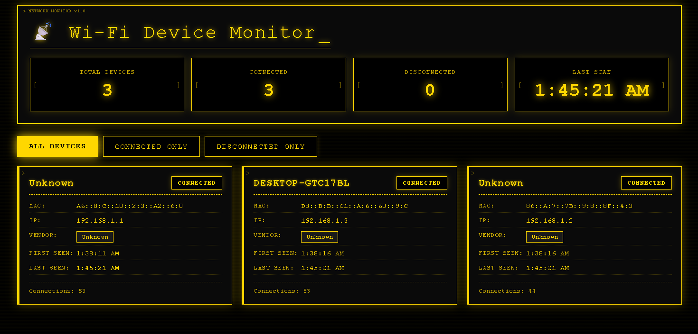

# Complete Documentation: Wi-Fi Device Monitor with Web Dashboard



## Table of Contents
1. [Project Overview](#project-overview)
2. [Folder Structure](#folder-structure)
3. [Installation Guide](#installation-guide)
4. [Environment Configuration](#environment-configuration)
5. [Running the Application](#running-the-application)
6. [Deep Dive: How Everything Works](#deep-dive-how-everything-works)
   - [6.1 Network Scanning Fundamentals](#61-network-scanning-fundamentals)
   - [6.2 config.py Explained](#62-configpy-explained)
   - [6.3 scanner.py - The Heart of the System](#63-scannerpy---the-heart-of-the-system)
   - [6.4 app.py - The Web Server](#64-apppy---the-web-server)
   - [6.5 templates/index.html - The Frontend Structure](#65-templatesindexhtml---the-frontend-structure)
   - [6.6 static/style.css - The Hacker Theme](#66-staticstylecss---the-hacker-theme)
   - [6.7 static/script.js - The Real-time Updates](#67-staticscriptjs---the-real-time-updates)
7. [Complete Workflow](#complete-workflow)
8. [Troubleshooting](#troubleshooting)
9. [Future Improvements](#future-improvements)

---

## Project Overview

The Wi-Fi Device Monitor is a real-time network scanning tool that continuously monitors your local network and displays all connected devices through a beautiful web dashboard with a hacker/terminal theme. It detects devices as they connect and disconnect, shows detailed information about each device (MAC address, IP address, vendor, hostname), and updates the display in real-time without page refreshes.

**Key Features:**
- Continuous network scanning (every 5 seconds by default)
- Real-time device detection (connect/disconnect events)
- Detailed device information extraction
- Vendor identification from MAC addresses
- Hostname resolution
- Connection history tracking
- Web-based dashboard with hacker aesthetic
- Filter devices by status (all/connected/disconnected)
- Live statistics (total devices, connected count, last scan time)

---

## Folder Structure

```
smart_lights_automation/
│
├── app.py                 # Flask web application - serves the dashboard and API
├── scanner.py             # Network scanning module - does the actual device detection
├── config.py              # Configuration settings - loads environment variables
├── requirements.txt       # Python dependencies - what needs to be installed
├── .env                   # Environment variables (you create this) - your settings
├── README.md              # Project documentation (optional)
│
├── templates/             # HTML templates for Flask
│   └── index.html         # Main dashboard page structure
│
└── static/                # Static files (CSS, JavaScript)
    ├── style.css          # Hacker theme styling - all the yellow/black goodness
    └── script.js          # Frontend JavaScript - handles real-time updates
```

---

## Installation Guide

### Prerequisites
- **Python 3.7 or higher** installed on your system
- **Administrator/Root privileges** (required for ARP scanning)
- **Network connection** to your local Wi-Fi/Ethernet

### Step-by-Step Installation

1. **Create project directory and navigate into it:**
   ```bash
   mkdir smart_lights_automation
   cd smart_lights_automation
   ```

2. **Create all the files** as shown in the folder structure above.

3. **Create a virtual environment** (recommended for isolating dependencies):
   ```bash
   # On Windows
   python -m venv venv
   venv\Scripts\activate

   # On macOS/Linux
   python3 -m venv venv
   source venv/bin/activate
   ```

4. **Install required packages:**
   ```bash
   pip install -r requirements.txt
   ```

   This installs:
   - `flask==2.3.3`: Web framework for the dashboard
   - `scapy==2.5.0`: Network packet manipulation library (does the ARP scanning)
   - `python-dotenv==1.0.0`: Loads environment variables from `.env` file
   - `schedule==1.2.0`: (Not used in current version but kept for future)
   - `rich==13.7.0`: (Not used but kept for future terminal formatting)
   - `ping3==4.0.4`: (Not used but kept for alternative scanning methods)

---

## Environment Configuration

The `.env` file (create this in the root directory) allows you to customize the application without changing code. Here's what each variable does:

```bash
# .env file - create this in the project root

# Network range to scan - MUST match your network
# Common values:
# - 192.168.1.0/24 for most home routers
# - 192.168.0.0/24 for some routers
# - 10.0.0.0/24 for some business networks
NETWORK_RANGE=192.168.1.0/24

# How often to scan the network (in seconds)
# Lower = more real-time but more network traffic
# Higher = less accurate but less resource usage
SCAN_INTERVAL=5

# Flask server settings
# 0.0.0.0 means accessible from other devices on your network
FLASK_HOST=0.0.0.0

# Port to run the web server on
# 5000 is Flask default, change if conflict
FLASK_PORT=5000

# Debug mode - True shows errors, False for production
FLASK_DEBUG=False
```

### How to find your network range:
- **On Windows**: Open Command Prompt and type `ipconfig`. Look for "IPv4 Address" under your Wi-Fi adapter. If it's `192.168.1.5`, your network range is `192.168.1.0/24`.
- **On macOS/Linux**: Open Terminal and type `ifconfig` or `ip addr`. Look for your IP address under your network interface.

The `/24` means "all IPs from 0 to 255" in that subnet.

---

## Running the Application

### Important: Run with Administrator/Root Privileges
ARP scanning requires special permissions because it sends raw network packets.

**On Windows:**
```bash
# Open Command Prompt as Administrator, then:
cd path\to\smart_lights_automation
venv\Scripts\activate
python app.py
```

**On macOS/Linux:**
```bash
sudo venv/bin/python app.py
# or if you're already in the venv
sudo python app.py
```

### Access the Dashboard
Once running, open your browser and go to:
- **From the same computer**: `http://localhost:5000`
- **From another device on your network**: `http://[YOUR-IP-ADDRESS]:5000` (e.g., `http://192.168.1.100:5000`)

You should see the hacker-themed dashboard with your network devices appearing in real-time.

---

## Deep Dive: How Everything Works

### 6.1 Network Scanning Fundamentals

Before diving into the code, understand how network discovery works:

**ARP (Address Resolution Protocol)** is used to map IP addresses to MAC addresses on a local network. When a device wants to communicate with another, it sends an ARP request: "Who has IP address X? Tell me." The device with that IP responds with its MAC address.

Our scanner sends an ARP request to **every possible IP** in the network range. Any device that's connected will respond, and we capture those responses. This is exactly what the `scapy` library does for us.

### 6.2 config.py Explained

```python
# config.py
import os
from dotenv import load_dotenv

# Load environment variables from .env file (if it exists)
load_dotenv()

# Network range - tells scanner which IPs to check
# os.getenv() looks for the variable in .env, if not found uses default
NETWORK_RANGE = os.getenv("NETWORK_RANGE", "192.168.1.0/24")

# How often to scan (in seconds)
SCAN_INTERVAL = int(os.getenv("SCAN_INTERVAL", 5))  # Convert to int

# Flask server settings
FLASK_HOST = os.getenv("FLASK_HOST", "0.0.0.0")  # 0.0.0.0 = all interfaces
FLASK_PORT = int(os.getenv("FLASK_PORT", 5000))   # Convert to int
FLASK_DEBUG = os.getenv("FLASK_DEBUG", "False").lower() == "true"  # Convert to boolean
```

**Why this matters:** By using environment variables, you can change settings without modifying code. This is crucial for:
- Running on different networks (different IP ranges)
- Running on different computers (different permissions)
- Production vs development environments

### 6.3 scanner.py - The Heart of the System

This is the most complex file. Let's break it down function by function.

#### 6.3.1 The DeviceInfo Class

This class represents a single device on your network.

```python
class DeviceInfo:
    def __init__(self, mac: str, ip: str):
        self.mac = mac                    # MAC address (unique hardware ID)
        self.ip = ip                       # Current IP address
        self.first_seen = datetime.now()   # When first discovered
        self.last_seen = datetime.now()     # Last time seen
        self.hostname = self._get_hostname(ip)  # Human-readable name
        self.vendor = self._get_vendor(mac)      # Manufacturer
        self.status = "connected"          # Current status
        self.connection_count = 1          # How many times seen
        self.ip_history = [(ip, datetime.now())]  # IP changes
```

**Why track all this?**
- **MAC address**: Unique identifier for the network card (never changes)
- **IP address**: Can change via DHCP, so we track history
- **First/Last seen**: Know when devices appear/disappear
- **Hostname**: Makes it human-readable ("Johns-iPhone" vs "192.168.1.5")
- **Vendor**: Tells you if it's Apple, Samsung, etc. from MAC prefix
- **Status**: Connected/disconnected in real-time
- **Connection count**: How many times they've reconnected
- **IP history**: Track if device changed IPs

#### 6.3.2 _get_hostname() - Reverse DNS Lookup

```python
def _get_hostname(self, ip: str) -> str:
    try:
        import socket
        return socket.gethostbyaddr(ip)[0]  # Try to get hostname
    except:
        return "Unknown"  # If fails, just call it Unknown
```

**How it works:** This performs a reverse DNS lookup. Many devices broadcast their hostname (like "Johns-MacBook-Pro.local"). If successful, you see the friendly name. If not, it's "Unknown".

#### 6.3.3 _get_vendor() - MAC Address Vendor Lookup

```python
def _get_vendor(self, mac: str) -> str:
    vendors = {
        "00:11:22": "Apple",
        "00:1E:C2": "Dell",
        # ... hundreds more ...
    }
    prefix = mac[:8].upper()  # Get first 3 bytes (e.g., "00:11:22")
    return vendors.get(prefix, "Unknown")
```

**The Magic:** The first 3 bytes of a MAC address (called the OUI - Organizationally Unique Identifier) are assigned to specific manufacturers. Apple owns certain prefixes, Intel owns others. By matching the prefix, we can guess the device manufacturer without any active probing.

#### 6.3.4 update() - Refreshing Device Info

```python
def update(self, ip: str):
    self.last_seen = datetime.now()        # Update last seen time
    self.connection_count += 1              # Increment connection counter
    if ip != self.ip:                       # If IP changed
        self.ip_history.append((ip, datetime.now()))  # Record the change
        self.ip = ip                          # Update current IP
```

**Why this matters:** Devices can get new IPs from DHCP. This tracks those changes so you can see if a device has moved or reconnected.

#### 6.3.5 The NetworkScanner Class

This class manages the scanning process and device database.

**__init__() - Initialization:**
```python
def __init__(self):
    self.devices: Dict[str, DeviceInfo] = {}  # All devices, keyed by MAC
    self.scan_count = 0                        # Total scans performed
    self.scanning = True                        # Control flag
    self.lock = threading.Lock()                # Thread safety
    self.last_scan_time = None                   # Last scan timestamp
```

**Threading.Lock:** Since scanning runs in a background thread and the web server reads device data in the main thread, we need a lock to prevent data corruption when both access the same data simultaneously.

#### 6.3.6 scan_network() - The Core Scanning Function

```python
def scan_network(self) -> Dict[str, str]:
    discovered = {}
    
    # Create ARP request packet
    arp_request = ARP(pdst=config.NETWORK_RANGE)  # Ask for all IPs
    ethernet_frame = Ether(dst="ff:ff:ff:ff:ff:ff")  # Broadcast to everyone
    broadcast_packet = ethernet_frame / arp_request  # Combine them

    try:
        # Send packet and wait for responses
        answered_packets = srp(
            broadcast_packet,
            timeout=3,        # Wait 3 seconds for replies
            verbose=0         # Don't print anything
        )[0]  # [0] contains answered packets

        # Process each response
        for _, received_packet in answered_packets:
            mac = received_packet.hwsrc.upper()  # Get sender's MAC
            ip = received_packet.psrc             # Get sender's IP
            discovered[mac] = ip                   # Store in dict

    except PermissionError:
        print("ERROR: Run this script as Administrator/Root")
        return {}
    except Exception as e:
        print(f"Scan error: {e}")
        return {}

    return discovered
```

**Step-by-step breakdown:**
1. **Create ARP request:** We ask "Who has each IP in our range?"
2. **Create Ethernet frame:** Set destination to broadcast (everyone)
3. **Combine:** Attach ARP request to Ethernet frame
4. **Send and receive:** `srp()` sends and waits for responses
5. **Process:** Each responding device gives us its MAC and IP

The returned dictionary maps MAC addresses to IP addresses for all devices that responded.

#### 6.3.7 update_devices() - Maintaining Device State

```python
def update_devices(self):
    current_devices = self.scan_network()  # Get current network state
    self.scan_count += 1
    self.last_scan_time = datetime.now()

    with self.lock:  # Thread safety
        # First, mark ALL existing devices as disconnected
        for device in self.devices.values():
            device.status = "disconnected"

        # Then, update devices that responded
        for mac, ip in current_devices.items():
            if mac in self.devices:  # Known device
                self.devices[mac].update(ip)  # Update its info
                self.devices[mac].status = "connected"  # Mark connected
            else:  # New device!
                self.devices[mac] = DeviceInfo(mac, ip)  # Create new entry
```

**The clever part:** By first marking all devices as disconnected, then only marking responding ones as connected, we automatically detect disconnections. Any device not in `current_devices` stays "disconnected".

#### 6.3.8 get_stats() - Gathering Statistics

```python
def get_stats(self):
    with self.lock:
        connected = sum(1 for d in self.devices.values() if d.status == "connected")
        return {
            "total_scans": self.scan_count,
            "total_devices": len(self.devices),
            "connected_devices": connected,
            "disconnected_devices": len(self.devices) - connected,
            "last_scan": self.last_scan_time.strftime("%Y-%m-%d %H:%M:%S") if self.last_scan_time else "Never"
        }
```

**What it calculates:**
- `total_scans`: How many times we've scanned since starting
- `total_devices`: Unique devices ever seen
- `connected_devices`: Currently active devices
- `disconnected_devices`: Devices seen before but not now
- `last_scan`: When we last checked

#### 6.3.9 start_scanning() - Background Thread

```python
def start_scanning(self):
    def scan_loop():
        while self.scanning:
            self.update_devices()  # Perform scan
            time.sleep(config.SCAN_INTERVAL)  # Wait

    thread = threading.Thread(target=scan_loop, daemon=True)
    thread.start()  # Start background thread
```

**Why daemon=True:** This makes the thread automatically terminate when the main program exits, preventing hanging processes.

### 6.4 app.py - The Web Server

Flask handles HTTP requests and serves our web interface.

```python
from flask import Flask, render_template, jsonify
from scanner import NetworkScanner
import config

app = Flask(__name__)
scanner = NetworkScanner()
scanner.start_scanning()  # Start background scanning immediately
```

#### Route: `/` - The Main Dashboard

```python
@app.route('/')
def index():
    return render_template('index.html')
```

This simply sends the HTML template to the browser. All the real work happens in JavaScript.

#### Route: `/api/devices` - Get Everything

```python
@app.route('/api/devices')
def get_devices():
    devices = scanner.get_all_devices()
    # Sort: connected devices first, then by last seen
    devices.sort(key=lambda x: (x['status'] != 'connected', x['last_seen']), reverse=True)
    return jsonify({
        'devices': devices,
        'stats': scanner.get_stats()
    })
```

**The sort key explained:**
- `x['status'] != 'connected'` gives `False` (0) for connected, `True` (1) for disconnected
- So connected devices (0) come before disconnected (1)
- `reverse=True` ensures newest appear first

#### Route: `/api/connected` - Filtered API

```python
@app.route('/api/connected')
def get_connected():
    return jsonify(scanner.get_connected_devices())
```

Returns only currently connected devices.

#### Route: `/api/stats` - Just Statistics

```python
@app.route('/api/stats')
def get_stats():
    return jsonify(scanner.get_stats())
```

Returns just the statistics without device list.

#### Running the Server

```python
if __name__ == '__main__':
    app.run(
        host=config.FLASK_HOST,
        port=config.FLASK_PORT,
        debug=config.FLASK_DEBUG,
        threaded=True  # Handle multiple simultaneous requests
    )
```

### 6.5 templates/index.html - The Frontend Structure

This is the skeleton of our dashboard. Key elements:

```html
<div class="stats" id="stats">
    <div class="stat-card">
        <span class="stat-label">Total Devices</span>
        <span class="stat-value" id="total-devices">0</span>  <!-- Updated by JS -->
    </div>
    <!-- More stat cards... -->
</div>

<div class="filters">
    <button class="filter-btn active" data-filter="all">All Devices</button>
    <button class="filter-btn" data-filter="connected">Connected Only</button>
    <button class="filter-btn" data-filter="disconnected">Disconnected Only</button>
</div>

<div class="device-grid" id="device-grid">
    <!-- JavaScript populates this dynamically -->
</div>
```

**data-filter attributes:** These tell JavaScript which filter to apply when clicked.

### 6.6 static/style.css - The Hacker Theme

This CSS creates the distinctive yellow-on-black terminal aesthetic. Let's analyze the key effects:

#### Background and Base Colors
```css
body {
    background: #000000;  /* Pure black */
    color: #ffd700;       /* Golden yellow */
    font-family: 'Courier New', monospace;  /* Terminal font */
}
```

#### Matrix-like Scan Lines
```css
body::before {
    content: "";
    background: repeating-linear-gradient(
        0deg,
        rgba(255, 215, 0, 0.03) 0px,
        rgba(0, 0, 0, 0.8) 2px,
        transparent 3px
    );
    /* Creates subtle horizontal lines like old CRT monitors */
}
```

#### Terminal Header Effect
```css
header::before {
    content: "> NETWORK MONITOR v1.0";  /* Terminal prompt */
    position: absolute;
    top: 5px;
    left: 10px;
    opacity: 0.5;
}

header::after {
    animation: scan 4s linear infinite;  /* Moving light effect */
    /* Creates "radar sweep" animation across header */
}
```

#### Bracket Decorations
```css
.stat-card::before {
    content: "[";  /* Opening bracket */
    left: 5px;
}

.stat-card::after {
    content: "]";  /* Closing bracket */
    right: 5px;
}
/* Every stat card is wrapped in [] like terminal output */
```

#### Status Indicators
```css
.device-card.connected {
    border-left: 5px solid #ffd700;  /* Yellow = active */
    box-shadow: 0 0 20px rgba(255, 215, 0, 0.3);  /* Glow effect */
}

.device-card.disconnected {
    border-left: 5px solid #666;  /* Gray = inactive */
    opacity: 0.6;  /* Faded appearance */
}
```

#### Blinking Cursor
```css
h1::after {
    content: "_";
    animation: blink 1s infinite;  /* Classic terminal cursor */
}

@keyframes blink {
    0%, 50% { opacity: 1; }
    51%, 100% { opacity: 0; }
}
```

#### Binary Rain Background
```css
body::after {
    content: "01001110 01100101...";  /* "Network Monitor" in binary */
    position: fixed;
    bottom: 10px;
    right: 10px;
    opacity: 0.1;  /* Very subtle */
    transform: rotate(180deg);  /* Creates rain effect */
    writing-mode: vertical-rl;   /* Vertical text */
}
```

### 6.7 static/script.js - The Real-time Updates

This file makes the dashboard dynamic.

#### Global State
```javascript
let currentFilter = 'all';  // Current filter selection
```

#### formatMac() - MAC Address Formatting
```javascript
function formatMac(mac) {
    return mac.toUpperCase().match(/.{1,2}/g).join(':');
}
// Input: "a1b2c3d4e5f6" → Output: "A1:B2:C3:D4:E5:F6"
```

**Regex explanation:** `/.{1,2}/g` matches every 1-2 characters, creating an array of pairs, then joins with colons.

#### formatDate() - Time Formatting
```javascript
function formatDate(dateString) {
    const date = new Date(dateString);
    return date.toLocaleTimeString();  // "14:35:22" format
}
```

#### createDeviceCard() - HTML Generator
```javascript
function createDeviceCard(device) {
    const statusClass = device.status === 'connected' ? 'connected' : 'disconnected';
    
    return `
        <div class="device-card ${statusClass}">
            <div class="device-header">
                <span class="device-name">${device.hostname || 'Unknown Device'}</span>
                <span class="status-badge ${statusClass}">${device.status}</span>
            </div>
            <!-- More device details... -->
        </div>
    `;
}
```

This function dynamically creates HTML for each device using template literals (backticks). The `${}` inserts JavaScript variables.

#### filterDevices() - Apply Current Filter
```javascript
function filterDevices(devices) {
    if (currentFilter === 'connected') {
        return devices.filter(d => d.status === 'connected');
    } else if (currentFilter === 'disconnected') {
        return devices.filter(d => d.status === 'disconnected');
    }
    return devices;  // 'all' filter returns everything
}
```

#### updateDisplay() - The Heart of Frontend
```javascript
function updateDisplay() {
    fetch('/api/devices')  // AJAX call to Flask
        .then(response => response.json())  // Parse JSON
        .then(data => {
            // Update statistics
            document.getElementById('total-devices').textContent = data.stats.total_devices;
            document.getElementById('connected-devices').textContent = data.stats.connected_devices;
            document.getElementById('disconnected-devices').textContent = data.stats.disconnected_devices;
            document.getElementById('last-scan').textContent = formatDate(data.stats.last_scan);

            // Update device grid
            const filteredDevices = filterDevices(data.devices);
            const grid = document.getElementById('device-grid');
            
            if (filteredDevices.length === 0) {
                grid.innerHTML = '<div style="...">> NO DEVICES FOUND</div>';
            } else {
                grid.innerHTML = filteredDevices.map(createDeviceCard).join('');
            }
        })
        .catch(error => {
            console.error('Error fetching devices:', error);
        });
}
```

**What's happening:**
1. `fetch()` makes an HTTP GET request to `/api/devices`
2. Gets JSON response with all devices and stats
3. Updates stat numbers in the HTML
4. Filters devices based on current filter
5. Converts each device to HTML using `map()`
6. Joins them and inserts into the grid

#### Event Listeners - Filter Buttons
```javascript
document.querySelectorAll('.filter-btn').forEach(btn => {
    btn.addEventListener('click', function() {
        // Remove active class from all buttons
        document.querySelectorAll('.filter-btn').forEach(b => b.classList.remove('active'));
        // Add active class to clicked button
        this.classList.add('active');
        // Update filter and refresh display
        currentFilter = this.dataset.filter;
        updateDisplay();
    });
});
```

#### Auto-refresh Timer
```javascript
// Update every 2 seconds
setInterval(updateDisplay, 2000);
// Run once immediately on page load
updateDisplay();
```

---

## Complete Workflow

Here's exactly what happens from start to finish:

### 1. Application Startup
1. User runs `python app.py` (with admin privileges)
2. Flask initializes and creates a `NetworkScanner` instance
3. `scanner.start_scanning()` launches background thread
4. Background thread immediately performs first scan
5. Flask starts web server on port 5000

### 2. Scanning Loop (Background Thread)
```
Every SCAN_INTERVAL seconds (default 5):
   1. Create ARP broadcast packet asking for all IPs in range
   2. Send packet and wait 3 seconds for responses
   3. Each responding device → (MAC, IP) pair
   4. Update devices dictionary:
      - Mark all existing devices as "disconnected"
      - For each responding device:
        * If new: Create DeviceInfo object
        * If existing: Update IP, last_seen, connection_count
        * Mark as "connected"
   5. Update last_scan_time and increment scan_count
```

### 3. Browser Access
1. User visits `http://localhost:5000`
2. Flask sends `index.html` to browser
3. Browser loads `style.css` and `script.js`
4. `script.js` immediately calls `updateDisplay()`

### 4. Real-time Updates (Every 2 seconds)
```
Browser → GET /api/devices → Flask → scanner.get_all_devices() → JSON → Browser

Browser receives JSON with:
{
    "devices": [
        {
            "mac": "AA:BB:CC:DD:EE:FF",
            "ip": "192.168.1.5",
            "hostname": "Johns-iPhone",
            "vendor": "Apple",
            "status": "connected",
            "first_seen": "2024-01-15 14:30:22",
            "last_seen": "2024-01-15 14:35:47",
            "connection_count": 3,
            "ip_history": [...]
        },
        ...
    ],
    "stats": {
        "total_scans": 42,
        "total_devices": 12,
        "connected_devices": 8,
        "disconnected_devices": 4,
        "last_scan": "2024-01-15 14:35:47"
    }
}

JavaScript then:
1. Updates stats in header
2. Filters devices based on current filter
3. Generates HTML cards for each device
4. Replaces content of device-grid
```

### 5. User Interaction
When user clicks "Connected Only" button:
1. Button click event triggers
2. `currentFilter` changes to "connected"
3. `updateDisplay()` called immediately
4. Same JSON data but filtered to show only connected devices

---

## Troubleshooting

### Common Issues and Solutions

#### "PermissionError: Run this script as Administrator/Root"
**Cause:** ARP scanning requires raw socket access.
**Solution:** Run with admin privileges (Windows) or sudo (macOS/Linux).

#### No devices showing up
**Possible causes:**
- Wrong network range in `.env`
- Firewall blocking ARP requests
- Network interface not active
- Running without admin privileges

**Solutions:**
1. Check your IP with `ipconfig` (Windows) or `ifconfig` (macOS/Linux)
2. Update `NETWORK_RANGE` in `.env`
3. Temporarily disable firewall for testing
4. Ensure you're on the same network as devices you want to see

#### Some devices not appearing
**Reasons:**
- Devices may ignore ARP requests (privacy settings)
- Mobile devices may sleep and not respond
- Some devices have ARP filtering enabled

**Solutions:**
- Try scanning when devices are active
- Check device power settings
- Some phones need to be awake and unlocked

#### Web page not loading
**Check:**
- Flask is running (look for startup messages)
- Port 5000 not blocked by firewall
- You're using correct URL (`http://localhost:5000` not `https://`)

#### MAC vendor detection not working
**Cause:** Our vendor list is not comprehensive.
**Solution:** Add more MAC prefixes to the `vendors` dictionary in `scanner.py`. You can find OUI lists online.

---

## Future Improvements

The project can be extended in many ways:

### 1. Device Recognition
- Add persistent device naming (save custom names)
- Recognize known devices by MAC and assign icons
- Group devices by type (phones, computers, IoT)

### 2. Notifications
- Alert when new unknown device connects
- Email/SMS when specific device (like kids' phones) comes home
- Push notifications to phone

### 3. Historical Data
- Store scan history in database (SQLite)
- Graphs of device presence over time
- Usage patterns (when devices typically connect/disconnect)

### 4. Network Analysis
- Bandwidth monitoring per device
- Port scanning for services
- Security alerts for suspicious devices

### 5. Smart Home Integration
- Trigger actions when phone connects (turn on lights)
- Integration with Home Assistant
- IFTTT webhooks

### 6. Enhanced UI
- Dark/light theme toggle
- Device icons based on vendor
- Expandable device details
- Export data to CSV

### 7. Multiple Network Support
- Scan multiple subnets
- VLAN support
- WiFi and Ethernet separate views

### 8. Performance Optimizations
- Asynchronous scanning
- Caching of vendor data
- Compressed data transfer

---

## Conclusion

This Wi-Fi Device Monitor demonstrates several important concepts:
- **Network programming** with ARP and Scapy
- **Threading** for background tasks
- **Web development** with Flask
- **Real-time updates** with AJAX
- **Data structures** for device tracking
- **Security** considerations (admin privileges)
- **UI/UX design** with hacker aesthetic

The system is modular, configurable, and extensible. You can use it as-is for network monitoring, or build upon it for smart home automation, security monitoring, or network analytics.

Remember: Always run with appropriate permissions, respect privacy, and use responsibly!