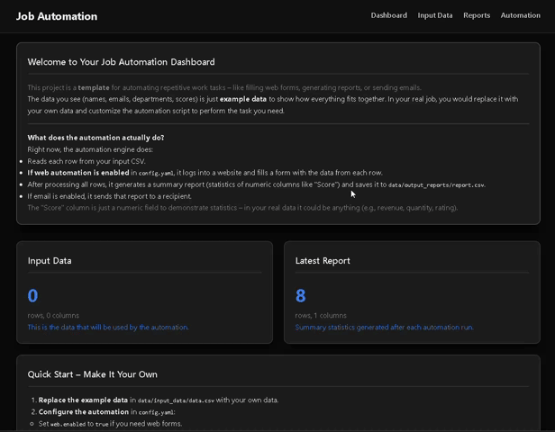

# Complete Documentation for Job Automation Dashboard

## Table of Contents
1. [Overview](#overview)
2. [Project Structure](#project-structure)
3. [Installation & Setup](#installation--setup)
   - [Prerequisites](#prerequisites)
   - [Clone / Download](#clone--download)
   - [Create Virtual Environment](#create-virtual-environment)
   - [Install Dependencies](#install-dependencies)
   - [Environment Variables (.env)](#environment-variables-env)
   - [Configuration File (config.yaml)](#configuration-file-configyaml)
4. [Running the Application](#running-the-application)
5. [Deep Dive: How Everything Works](#deep-dive-how-everything-works)
   - [Application Factory (`app/__init__.py`)](#application-factory-app__init__py)
   - [Configuration (`app/config.py`)](#configuration-appconfigpy)
   - [Data Management (`app/models/data_manager.py`)](#data-management-appmodelsdata_managerpy)
   - [Report Management (`app/models/report_manager.py`)](#report-management-appmodelsreport_managerpy)
   - [Routes (Blueprints)](#routes-blueprints)
     - [Main Routes (`app/routes/main.py`)](#main-routes-approutesmainpy)
     - [Data Routes (`app/routes/data.py`)](#data-routes-approutesdatapy)
     - [Reports Routes (`app/routes/reports.py`)](#reports-routes-approutesreportspy)
     - [Automation Routes (`app/routes/automation.py`)](#automation-routes-approutesautomationpy)
   - [Automation Engine (`app/services/automation_engine.py`)](#automation-engine-appservicesautomation_enginepy)
   - [Scheduler (`app/services/scheduler.py`)](#scheduler-appservicesschedulerpy)
   - [Templates (`app/templates/`)](#templates-apptemplates)
   - [Static Files (`app/static/`)](#static-files-appstatic)
   - [Entry Point (`run.py`)](#entry-point-runpy)
6. [Workflows](#workflows)
   - [Adding/Editing/Deleting Data](#addingeditingdeleting-data)
   - [Uploading CSV Data](#uploading-csv-data)
   - [Running Automation Manually](#running-automation-manually)
   - [Scheduled Automation](#scheduled-automation)
   - [Generating and Emailing Reports](#generating-and-emailing-reports)
7. [Customizing for Your Own Job Automation](#customizing-for-your-own-job-automation)
8. [Troubleshooting](#troubleshooting)
9. [Conclusion](#conclusion)

---

## Overview

This project is a **Flask-based web dashboard** designed to automate repetitive work tasks. It provides a user interface to manage input data, trigger automation cycles (which can include web form filling, report generation, and email sending), and view generated reports. The system is built as a **template** – you can replace the example data and adapt the automation logic to your specific job requirements (e.g., filling timesheets, submitting orders, generating invoices).

**Key features:**
- Web interface to view, add, edit, delete, and upload CSV data.
- Scheduler that runs automation at a fixed interval (configurable).
- Automation engine using **Selenium** to interact with web forms (if enabled).
- Generation of summary reports (using `pandas` describe) and saving as CSV.
- Email reports via SMTP (if configured).
- Fully customizable via `config.yaml` and `.env` files.

---

## Project Structure

```
.
├── .env                       # Environment variables (sensitive data)
├── .env.example                # Example environment file
├── app/                        # Main application package
│   ├── __init__.py             # Flask app factory
│   ├── config.py               # Loads config.yaml and sets paths
│   ├── models/                  # Data handling modules
│   │   ├── __init__.py
│   │   ├── data_manager.py      # CRUD operations on input data CSV
│   │   └── report_manager.py    # Read/write report CSV
│   ├── routes/                  # Blueprints for web routes
│   │   ├── __init__.py
│   │   ├── main.py              # Dashboard home
│   │   ├── data.py              # Data management pages
│   │   ├── reports.py           # View and send reports
│   │   └── automation.py        # Control automation (start/stop/run once)
│   ├── services/                 # Core automation logic
│   │   ├── __init__.py
│   │   ├── automation_engine.py  # Web automation + report generation
│   │   └── scheduler.py          # Background scheduler thread
│   ├── static/                    # CSS, JS
│   │   ├── css/
│   │   │   └── style.css
│   │   └── js/
│   │       └── main.js
│   └── templates/                 # Jinja2 HTML templates
│       ├── base.html
│       ├── index.html
│       ├── data_list.html
│       ├── data_add.html
│       ├── data_edit.html
│       ├── data_upload.html
│       ├── reports.html
│       └── automation.html
├── config.yaml                  # Main configuration (non-sensitive)
├── data/                         # Data directory
│   ├── input_data/                # Input CSV files
│   │   └── data.csv               # Example input data
│   └── output_reports/             # Generated reports
│       └── report.csv              # Example report
├── project_structure.txt         # Auto-generated tree (optional)
├── README.md                     # Project readme
├── requirements.txt              # Python dependencies
├── run.py                        # Entry point to start the app
└── sample.gif                    # Demo animation
```

---

## Installation & Setup

### Prerequisites
- Python 3.8+ installed.
- Google Chrome browser (for Selenium web automation).
- ChromeDriver matching your Chrome version (automatically handled if using `webdriver-manager`, but here we assume ChromeDriver is in PATH or use direct path).

### Clone / Download
Get the project files (if you have them). Place them in a folder, e.g., `job-automation-dashboard`.

### Create Virtual Environment
```bash
cd job-automation-dashboard
python -m venv venv
source venv/bin/activate      # On Windows: venv\Scripts\activate
```

### Install Dependencies
```bash
pip install -r requirements.txt
```
**Contents of `requirements.txt`:**
- `Flask` – web framework
- `pandas` – data manipulation
- `selenium` – browser automation
- `pyyaml` – parse YAML config
- `python-dotenv` – load `.env` file

### Environment Variables (.env)
Create a `.env` file in the project root (or copy from `.env.example`). This file stores sensitive information that should **not** be committed to version control.

Example `.env`:
```ini
SECRET_KEY=your-secret-key-here
FLASK_DEBUG=True

# Web automation credentials (used by automation_engine)
WEB_USERNAME=your_web_username
WEB_PASSWORD=your_web_password

# Email sender credentials (used by reports route to send email)
EMAIL_SENDER=sender@example.com
EMAIL_PASSWORD=your_email_password
```

**Explanation of each variable:**
- `SECRET_KEY`: Flask secret key for session security. Can be any random string.
- `FLASK_DEBUG`: Set to `True` for development (auto-reload, debug mode). Set to `False` in production.
- `WEB_USERNAME` / `WEB_PASSWORD`: Credentials used to log into the web application that you want to automate. These are used by `automation_engine.login_to_web_app()`.
- `EMAIL_SENDER` / `EMAIL_PASSWORD`: Credentials for the email account that will send reports. Used by the `/reports/send` route to send email via SMTP.

### Configuration File (config.yaml)
`config.yaml` holds non-sensitive configuration for the automation behavior. Edit it to match your target website and preferences.

Example `config.yaml`:
```yaml
web:
  enabled: false                     # Set true to enable Selenium automation
  login_url: "https://example.com/login"
  username_field: "username"         # ID of username input field
  password_field: "password"         # ID of password input field
  login_button: "login-btn"          # ID of login button
  submit_button: "submit-btn"        # ID of form submit button after filling

form_mapping:
  Name: "fullname_field"              # Map CSV column 'Name' to form field ID 'fullname_field'
  Email: "email_field"
  Department: "dept_field"
  Score: "score_field"

email:
  smtp_server: "smtp.gmail.com"       # SMTP server (e.g., for Gmail)
  smtp_port: 587
  subject: "Automation Report"
  body: "Please find attached the latest report."
```

**Explanation:**
- `web`: Contains settings for web automation.
  - `enabled`: If `false`, the automation engine will skip the web part and only generate a report.
  - `login_url`: The URL of the login page.
  - `username_field`, `password_field`, `login_button`: IDs of elements on the login page.
  - `submit_button`: ID of the submit button on the form that gets filled for each row.
- `form_mapping`: Maps CSV column names to the IDs of form fields on the target page. This is used in `fill_form()` to send data.
- `email`: SMTP settings for sending reports.
  - `smtp_server`, `smtp_port`: SMTP server address and port.
  - `subject`, `body`: Email subject and body text.

**Note:** The email credentials (sender/password) are taken from `.env` for security, not from `config.yaml`.

---

## Running the Application

1. Make sure your virtual environment is activated and dependencies installed.
2. Ensure `.env` and `config.yaml` are properly configured.
3. Run the Flask development server:
   ```bash
   python run.py
   ```
4. Open your browser and go to `http://localhost:5000`.

The dashboard will be live.

---

## Deep Dive: How Everything Works

### Application Factory (`app/__init__.py`)
This file creates the Flask app using a factory pattern.

```python
def create_app():
    app = Flask(__name__)
    app.config.from_object(Config)      # Load configuration from config.py
    logging.basicConfig(...)             # Set up logging
    # Register blueprints
    from app.routes.main import main_bp
    from app.routes.data import data_bp
    from app.routes.reports import reports_bp
    from app.routes.automation import automation_bp
    app.register_blueprint(main_bp)
    app.register_blueprint(data_bp, url_prefix='/data')
    app.register_blueprint(reports_bp, url_prefix='/reports')
    app.register_blueprint(automation_bp, url_prefix='/automation')
    return app
```
- Blueprints organise routes into modules.
- `url_prefix` adds a prefix to all routes in that blueprint (e.g., `/data/` for data routes).

### Configuration (`app/config.py`)
- Loads environment variables from `.env` using `load_dotenv()`.
- Reads `config.yaml` and stores it as `automation_config`.
- Defines `Config` class with:
  - `SECRET_KEY`, `DEBUG` from environment.
  - `BASE_DIR`, `DATA_DIR`, `INPUT_DIR`, `OUTPUT_DIR` – absolute paths.
  - Creates those directories if they don’t exist.

This ensures paths are always available.

### Data Management (`app/models/data_manager.py`)
Handles reading and writing the input data CSV (`data/input_data/data.csv`).

**Functions:**
- `read_data()`: Returns a pandas DataFrame from the CSV. If the file doesn’t exist or is empty, creates a default DataFrame with `DEFAULT_COLUMNS` (Name, Email, Department, Score) and saves it. This ensures the app always has a valid data structure.
- `write_data(df)`: Saves the DataFrame back to CSV.
- `add_row(row_dict)`: Appends a new row (dictionary) to the existing data.
- `update_row(index, row_dict)`: Updates a row at given index.
- `delete_row(index)`: Deletes a row by index.
- `append_data(new_df)`: Concatenates a new DataFrame to the existing one, aligning columns (union of columns). Used when uploading CSV with “Append” option.

All functions use pandas for efficient data handling.

### Report Management (`app/models/report_manager.py`)
Similar to data_manager but for the report CSV (`data/output_reports/report.csv`).

- `read_report()`: Reads the report CSV. Handles empty/missing files and returns an empty DataFrame.
- `write_report(df)`: Writes the DataFrame to CSV, including the index (because `describe()` output uses the statistic names as index).

### Routes (Blueprints)

#### Main Routes (`app/routes/main.py`)
- `@main_bp.route('/')` – Dashboard home.
  - Reads input data and report data via data_manager and report_manager.
  - Passes row/column counts to `index.html` template.
  - Provides a welcome message explaining the project’s purpose.

#### Data Routes (`app/routes/data.py`)
All routes under `/data`.

- `list_data()` (`GET /`): Displays all records in a table. Uses `data_manager.read_data()`.
- `add()` (`GET /add`, `POST /add`): Form to add a new row. On POST, calls `data_manager.add_row()`.
- `edit(index)` (`GET /edit/<int:index>`, `POST /edit/<int:index>`): Edit form pre-filled with existing row data. On POST, calls `data_manager.update_row()`.
- `delete(index)` (`GET /delete/<int:index>`): Deletes row, then redirects.
- `upload()` (`GET /upload`, `POST /upload`): Handles CSV upload (file or pasted text). Uses pandas to read, optionally strips whitespace, then either appends or replaces data via `data_manager.append_data()` or `data_manager.write_data()`. Supports radio buttons to choose action.
- `clear_all()` (`GET /clear_all`): Creates an empty DataFrame with default columns and overwrites the CSV.

**Note:** Flash messages are used to provide user feedback.

#### Reports Routes (`app/routes/reports.py`)
- `view_report()` (`GET /`): Reads the report CSV, renames index column to 'Statistic', rounds numeric columns, and passes to `reports.html`.
- `send_report()` (`POST /send`): Sends the report via email.
  - Retrieves recipient from form.
  - Reads email settings from `config.yaml` and `.env`.
  - Attaches the report CSV and sends using `smtplib`.
  - Handles errors and flashes appropriate messages.

#### Automation Routes (`app/routes/automation.py`)
- `status()` (`GET /`): Shows automation control page with current running status and interval.
- `start()` (`POST /start`): Calls `scheduler.start()` to begin periodic runs.
- `stop()` (`POST /stop`): Calls `scheduler.stop()`.
- `run_once()` (`POST /run_once`): Starts a background thread that runs `run_automation_once()` immediately. This allows one-off execution without affecting the scheduled interval.

### Automation Engine (`app/services/automation_engine.py`)
This is the heart of the automation. It performs one full cycle.

**Functions:**
- `setup_driver(headless=True)`: Creates a Chrome WebDriver with headless option (no GUI). Can be changed to `headless=False` for debugging.
- `login_to_web_app(driver, config)`: Navigates to login URL, waits for username/password fields, enters credentials from `.env`, and clicks login. Uses explicit waits.
- `fill_form(driver, row, config)`: For a given row (a pandas Series), it uses `form_mapping` from config to find each form field by ID, clears it, and sends the value. Then clicks submit. A short sleep ensures form submission completes.
- `run_automation_once()`: The main entry point for a cycle.
  - Reads input data via `data_manager.read_data()`.
  - If `web.enabled` is True:
    - Sets up driver, logs in, iterates over each row and calls `fill_form()`.
    - Catches exceptions and logs errors.
    - Quits driver.
  - Generates a report using `df.describe()` and writes it via `report_manager.write_report()`.
  - Logs completion.

**Note:** The example `fill_form` is simplistic; you should modify it to match the actual structure of the web form you are automating (e.g., different selectors, dropdowns, file uploads). The mapping in `config.yaml` should reflect the actual form field IDs.

### Scheduler (`app/services/scheduler.py`)
Provides a simple background thread that runs automation at fixed intervals.

**Class `AutomationScheduler`:**
- `__init__(interval_seconds)`: Sets interval (default 60 seconds).
- `start()`: Starts the background thread if not already running. The thread runs `_run_loop()`.
- `stop()`: Signals the loop to stop and joins the thread.
- `_run_loop()`: While `_running` is True, calls `run_automation_once()` and then sleeps for `interval` seconds, checking every second if stop was requested (to allow quick shutdown).

A global instance `scheduler` is created with a default interval of 60 seconds. You can change the interval by editing `scheduler.py` or by making it configurable (not implemented yet, but could be extended).

### Templates (`app/templates/`)
All HTML files use Jinja2 templating and extend `base.html`.

- `base.html`: Contains the common layout: navbar, container, flash messages, footer. Links to `style.css`.
- `index.html`: Dashboard home with explanatory cards and quick links.
- `data_list.html`: Displays input data table with Edit/Delete buttons and action buttons (Add, Upload, Clear All).
- `data_add.html`: Form to add a new row. Fields are generated dynamically from the current columns.
- `data_edit.html`: Similar to add, but pre-filled with existing row values.
- `data_upload.html`: Two cards: file upload and text paste. Radio buttons for append/replace.
- `reports.html`: Shows the statistics table (if any) and a form to send the report via email.
- `automation.html`: Shows current status (running/stopped) and buttons to Start, Stop, Run Once. Includes JavaScript to make AJAX POST requests to the automation endpoints and reload the page on success.

### Static Files (`app/static/`)
- `css/style.css`: All custom styling. Uses dark theme with CSS variables for easy customization. Includes styles for cards, tables, forms, alerts, buttons, etc.
- `js/main.js`: Currently empty, but you can add custom JavaScript here.

### Entry Point (`run.py`)
- Imports `create_app` and the global `scheduler`.
- Creates the app.
- Optionally, you could start the scheduler automatically, but by default it’s commented out; user starts via web.
- Registers `atexit` to stop scheduler when the app exits.
- Runs the Flask development server with `debug=True`, listening on all interfaces (`0.0.0.0`) on port 5000.

---

## Workflows

### Adding/Editing/Deleting Data
1. Go to **Input Data** from navbar.
2. Click **Add New Row** → fill form → submit → row appended.
3. Click **Edit** on any row → modify → submit → row updated.
4. Click **Delete** on any row → confirm → row removed.
5. Click **Clear All** → confirm → all rows removed (only default columns remain).

### Uploading CSV Data
1. Go to **Input Data** → **Upload CSV**.
2. Choose either:
   - Upload a CSV file by selecting it.
   - Paste CSV text (including header) into the textarea.
3. Select **Append** (add rows to existing) or **Replace** (overwrite entire data).
4. Click Upload/Import. The system will:
   - Read CSV, strip whitespace from string columns.
   - Perform action.
   - Redirect to data list with success message.

### Running Automation Manually
- From **Automation** page, click **Run Once Now**. This triggers one cycle in the background. You’ll see an alert; check the **Reports** page after a few seconds to see the updated report.

### Scheduled Automation
- On **Automation** page, click **Start** to begin periodic runs every 60 seconds (interval can be changed in `scheduler.py`).
- Click **Stop** to halt the scheduler.
- While running, the automation will continue to process data and update reports at each interval.

### Generating and Emailing Reports
- After an automation run (manual or scheduled), go to **Reports**.
- If a report exists, you’ll see a statistics table.
- Enter a recipient email and click **Send Report**. The system will attach `report.csv` and email it using the configured SMTP settings.

---

## Customizing for Your Own Job Automation

1. **Replace the example data** in `data/input_data/data.csv` with your real data. Ensure the columns match what you need for your automation.
2. **Configure `config.yaml`**:
   - Set `web.enabled: true` if you need web automation.
   - Update `login_url`, field IDs, and `form_mapping` to match your target website.
   - If you don't need web automation, set `enabled: false` – then the engine will only generate a report.
   - Configure email settings if you want to send reports.
3. **Customize the automation logic** in `app/services/automation_engine.py`:
   - Modify `fill_form()` to handle your actual form: maybe you need to select dropdowns, handle iframes, wait for elements, etc. Use Selenium’s `WebDriverWait` as needed.
   - You can also change the report generation: instead of `describe()`, you might want to generate a different kind of report (e.g., pivot table, charts saved as images). Modify `run_automation_once()` accordingly.
4. **Adjust the scheduler interval** in `scheduler.py` (or make it configurable via `config.yaml`).
5. **Update templates** if you want different UI text or additional features.

---

## Troubleshooting

- **Selenium not finding elements**: Ensure the IDs in `config.yaml` match exactly the `id` attributes on the web page. Use browser developer tools to inspect.
- **Login fails**: Check that `WEB_USERNAME` and `WEB_PASSWORD` are set correctly in `.env`. Also verify the login page URL and that the fields are present.
- **Email not sending**: Verify SMTP server and port, and that sender credentials are correct. For Gmail, you may need to enable “Less secure app access” or use an App Password if 2FA is enabled.
- **File not found errors**: Ensure the `data/input_data` and `data/output_reports` directories exist (they are created automatically by `config.py`). Check permissions.
- **Scheduler not stopping**: The stop mechanism uses a flag and a 1-second sleep check. It should stop within the interval. If it hangs, you can kill the process.

---

## Conclusion

This job automation dashboard is a flexible template that you can adapt to a wide range of repetitive tasks. By understanding each component – from data management to the automation engine and scheduler – you can tailor it to your specific needs. The provided documentation should give you a solid foundation to start building your own automation solution. If you have further questions, refer to the code comments or extend the functionality as required. Happy automating!