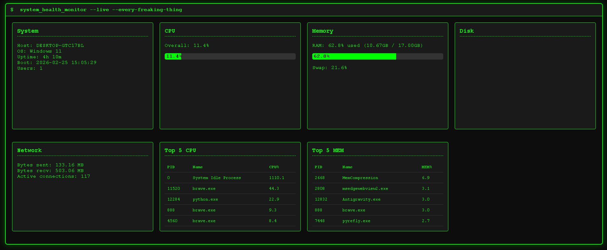

# System Health Monitor – Terminal UI

A real-time system monitoring dashboard with a retro terminal aesthetic. Built with Python (Flask) and psutil for backend data collection, and JavaScript (jQuery + Chart.js) for the frontend.

---

## 1. Overview

This application provides a web-based dashboard that displays live system metrics:

- **CPU**: overall usage, per-core usage, frequency, load average, core counts
- **Memory**: RAM and swap usage
- **Disk**: partition usage and disk I/O statistics
- **Network**: interface addresses, bytes sent/received, active connections
- **Sensors**: temperatures, fans, battery status (where available)
- **Processes**: top 5 CPU and memory consuming processes
- **System**: hostname, OS, uptime, boot time, logged-in users

The backend collects data using the `psutil` library and exposes a JSON API via Flask. The frontend polls this API every 2 seconds and updates the dashboard dynamically.

---

## 2. Folder Structure

```
system-health-monitor/
│
├── app.py                     # Main Flask application
├── requirements.txt           # Python dependencies
├── static/
│   ├── script.js              # Frontend JavaScript
│   └── style.css              # Terminal-themed CSS
└── templates/
    └── index.html             # Single HTML page
```

---

## 3. Setup and Installation

### Prerequisites

- Python 3.7 or higher
- `pip` (Python package manager)
- A modern web browser

### Virtual Environment (Recommended)

Create and activate a virtual environment to isolate dependencies:

```bash
python -m venv venv
source venv/bin/activate      # On Linux/macOS
venv\Scripts\activate         # On Windows
```

### Installing Dependencies

Install the required packages from `requirements.txt`:

```bash
pip install -r requirements.txt
```

**Contents of `requirements.txt`**:

```
Flask==2.2.3
Flask-CORS==3.0.10
psutil==5.9.4
```

- `Flask`: lightweight web framework.
- `Flask-CORS`: allows Cross-Origin Resource Sharing (useful if frontend is served separately, though here it's same origin).
- `psutil`: cross-platform library for system information.

---

## 4. Running the Application

Start the Flask development server:

```bash
python app.py
```

By default, the server runs on `http://0.0.0.0:5000`. Open your browser and navigate to `http://localhost:5000` (or the IP address of the machine if accessing remotely).

**Note**: The app runs in debug mode (`debug=True`) which enables auto-reloading on code changes. For production, disable debug and use a proper WSGI server.

---

## 5. Detailed Code Walkthrough

### Backend – `app.py`

#### Imports and Configuration

```python
import psutil
import platform
import time
from flask import Flask, render_template, jsonify
from flask_cors import CORS

app = Flask(__name__)
CORS(app)
```

- `psutil`: retrieves system information.
- `platform`: gets OS-level details.
- `time`: for timestamps and uptime calculation.
- Flask modules: create app, enable CORS (allows requests from any origin – useful during development).

#### Helper: `get_size(bytes)`

Converts a byte count into a human-readable string (e.g., `1024` → `1.00 KB`).

```python
for unit in ['B', 'KB', 'MB', 'GB', 'TB']:
    if bytes < 1024.0:
        return f"{bytes:.2f} {unit}"
    bytes /= 1024.0
return f"{bytes:.2f} PB"
```

- Iterates through units, dividing by 1024 each step.
- Returns formatted string with appropriate unit.

#### CPU Information – `get_cpu_info()`

Gathers CPU statistics:

- `percent`: overall CPU usage (sampled over 0.5 seconds).
- `per_cpu`: per-core usage percentages.
- `cores`: total logical cores.
- `physical_cores`: number of physical cores.
- `freq`: current CPU frequency (if available).
- `load_avg`: load average (1,5,15 minutes) converted to percentage of total cores.

Error handling ensures the function doesn't crash if certain data isn't available (e.g., on some platforms).

#### Memory Information – `get_memory_info()`

- `virtual`: RAM usage details (total, available, percent, used, free, etc.) using `psutil.virtual_memory()`.
- `swap`: swap memory statistics; wrapped in try/except because swap may not be available or accessible.

#### Disk Information – `get_disk_info()`

Iterates over all disk partitions (`psutil.disk_partitions()`). For each mountpoint, attempts to get disk usage with `psutil.disk_usage()`. If permission denied or other OS error, it skips the partition (logs a message). Also tries to get disk I/O counters (optional, may fail on some systems).

Returns a dict containing:

- `partitions`: list of dicts with device, mountpoint, fstype, total, used, free, percent (all human-readable via `get_size` except percent).
- `io`: disk I/O statistics (read/write counts, bytes, time) if available.

#### Network Information – `get_network_info()`

- `interfaces`: network interface addresses (IPv4, IPv6, MAC) for each interface.
- `io`: network I/O counters (bytes sent/received, packets, errors).
- `connections`: number of active network connections; may raise `AccessDenied` on some systems, returns -1 in that case.

Each section is wrapped in try/except to handle permissions or missing data.

#### Sensors Information – `get_sensors_info()`

Checks for available sensor data using `psutil` methods:

- `sensors_temperatures()`: hardware temperatures (CPU, GPU, etc.).
- `sensors_fans()`: fan speeds.
- `sensors_battery()`: battery status.

Returns a dictionary with keys `temperatures`, `fans`, `battery` if data exists.

#### Processes Information – `get_processes_info()`

Iterates over all running processes using `psutil.process_iter()` with a list of attributes: `pid`, `name`, `cpu_percent`, `memory_percent`. Filters out processes where either percentage is `None`. Then sorts to get the top 5 CPU consumers and top 5 memory consumers.

Returns a dict with `cpu_top` and `mem_top` lists.

#### System Information – `get_system_info()`

- `hostname`: network node name.
- `system`: OS name and release.
- `version`: OS version string.
- `machine`: hardware architecture.
- `processor`: processor type.
- `boot_time`: formatted boot time.
- `uptime_seconds`: seconds since boot.
- `users`: list of logged-in users (from `psutil.users()`).

#### Flask Routes

- **`@app.route('/')`** – Serves the main HTML page (`index.html`).
- **`@app.route('/api/stats')`** – Returns a JSON response containing all system stats. Calls all the above functions and combines them into one dictionary.

### Frontend – `static/script.js`

#### Global `charts` Object

```javascript
let charts = {};
```

Stores references to Chart.js instances, keyed by canvas ID. Allows updating charts without recreating them.

#### `createOrUpdateChart(ctx, type, data, options)`

If a chart already exists for the given canvas context, it updates the chart's data and calls `update()`. Otherwise, it creates a new Chart instance and stores it in `charts`.

#### `renderDashboard(data)`

Takes the JSON data from the API and dynamically builds HTML for the dashboard. It:

- Constructs a string containing cards for each section.
- Uses progress bars for CPU, memory, and disk usage.
- Creates a canvas element for the CPU per-core bar chart.
- After injecting the HTML into `#dashboard`, it retrieves the canvas context and calls `createOrUpdateChart` to render the CPU chart.

**Key sections built**:

- System card: hostname, OS, uptime, boot time, user count.
- CPU card: overall percentage, progress bar, canvas for per-core chart.
- Memory card: RAM usage with progress bar, swap usage if available.
- Disk card: for each partition, show usage with progress bar.
- Network card: bytes sent/received, active connections.
- Top 5 CPU processes table.
- Top 5 memory processes table.
- Sensors: temperatures and battery if present.

#### `fetchStats()`

Uses jQuery's `$.getJSON` to call `/api/stats` and passes the response to `renderDashboard`.

#### Polling

```javascript
$(document).ready(function() {
    fetchStats();
    setInterval(fetchStats, 2000);
});
```

Fetches stats immediately on page load, then every 2 seconds thereafter.

### Styling – `static/style.css`

Provides a retro terminal look:

- Black background (`#0a0a0a`), green text (`#00ff00`), monospace font.
- Cards with green borders and dark backgrounds.
- Progress bars filled with green.
- Grid layout using CSS Grid (`grid-template-columns: repeat(auto-fit, minmax(400px, 1fr))`).
- Responsive design: cards wrap as window resizes.

### HTML Template – `templates/index.html`

- Includes Chart.js (from CDN) and jQuery.
- Links to local `style.css` and `script.js`.
- A `<div id="dashboard">` placeholder where JavaScript injects the dynamic content.
- Terminal-style header with a fake command prompt.

---

## 6. Workflow Explanation

### Data Flow

1. **Browser** loads `index.html`.
2. **JavaScript** executes `fetchStats()` on document ready.
3. **Flask** endpoint `/api/stats` is called.
4. **Backend** gathers all system stats using `psutil` and returns JSON.
5. **Frontend** receives data and calls `renderDashboard()`.
6. `renderDashboard()` builds HTML and creates/updates the CPU chart.
7. **Polling** repeats every 2 seconds, updating the displayed data.

### Update Cycle

- The entire dashboard is re-rendered on every poll (HTML string rebuilt). This is simple but may cause flickering in large dashboards; however, for this scale it's acceptable.
- Charts are updated in-place using Chart.js's update mechanism, preserving smooth transitions.

---

## 7. Configuration and Customization

There is no separate configuration file. All settings are hardcoded, but you can modify them directly in the source:

- **Polling interval**: change the `2000` ms in `setInterval(fetchStats, 2000)`.
- **Chart colors**: modify `backgroundColor` and `borderColor` in `createOrUpdateChart`.
- **Metrics displayed**: add or remove fields from the backend functions or the frontend rendering.

To run on a different port or host, change the `app.run()` arguments.

---

## 8. Error Handling and Edge Cases

The application is designed to be robust across different operating systems and environments:

- **Disk partitions**: If a partition is inaccessible (permission denied), it is skipped gracefully.
- **Swap memory**: If swap is not available, an empty dict is returned.
- **Sensors**: Functions check for existence before calling; any exception is ignored.
- **Network connections**: `psutil.net_connections()` may require root/admin privileges; the code catches `AccessDenied` and returns `-1`.
- **Process iteration**: Some processes may disappear during iteration; `NoSuchProcess` is caught.
- **Load average**: Not available on all platforms; the code checks for `hasattr(psutil, "getloadavg")`.

**Important**: On Windows, some features (like disk I/O, sensors) may not be fully supported.

---

## 9. Dependencies and Their Roles

| Package      | Purpose |
|--------------|---------|
| Flask        | Web framework to serve the dashboard and JSON API. |
| Flask-CORS   | Enables CORS headers; not strictly necessary for same-origin but included for flexibility. |
| psutil       | Cross-platform system information gathering: CPU, memory, disk, network, processes, sensors, users, boot time. |

---

## 10. Conclusion

The System Health Monitor is a lightweight, self-contained tool for real-time system monitoring. It leverages the power of `psutil` to collect detailed metrics and presents them in a visually appealing terminal-style dashboard. The code is modular, well-commented, and handles errors gracefully, making it easy to extend or adapt for different use cases.

Whether you're a system administrator checking server health or a developer learning about Flask and real-time web UIs, this project provides a solid foundation to build upon.