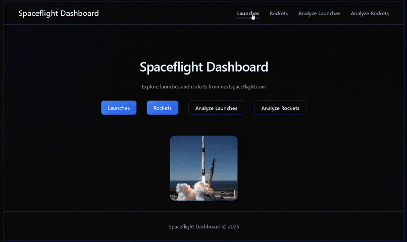

# Spaceflight Dashboard – Complete Documentation

## 1. Project Overview

This project is a web-based dashboard for exploring and analyzing upcoming space launches and rockets. It scrapes data from [nextspaceflight.com](https://nextspaceflight.com) using Selenium, stores it in CSV files, processes it with Pandas, and serves a Flask web application with interactive tables and charts. The dashboard provides:

- A homepage with navigation.
- Listings of launches and rockets with images, details, and modals.
- Analytical views with charts (pie, bar, line) for launches (by agency, status, month) and rockets (by agency).
- Optional JSON API endpoints for the statistics.

The application is designed to be run locally after fetching the data.

## 2. Folder Structure

```
project_root/
│
├── data/
│   ├── launches.csv          # Scraped launch data
│   └── rockets.csv            # Scraped rocket data
│
├── static/
│   ├── css/
│   │   └── style.css          # Custom styling
│   └── js/
│       └── main.js             # Client-side interactivity (modals)
│
├── templates/
│   ├── base.html               # Base template with navbar, footer, scripts
│   ├── index.html               # Homepage
│   ├── launches.html            # Table of launches + modals
│   ├── rockets.html             # Table of rockets + modals
│   ├── analyze_launches.html    # Launch statistics with charts
│   └── analyze_rockets.html     # Rocket statistics with charts
│
├── analyze_launches.py          # Launch analysis functions (Pandas)
├── analyze_rockets.py           # Rocket analysis functions (Pandas)
├── app.py                       # Flask application (routes, server)
├── fetch_launches.py             # Selenium scraper for launches
├── fetch_rockets.py              # Selenium scraper for rockets
├── requirements.txt              # Python dependencies
├── visualize.py                  # Placeholder (currently empty)
└── README.md                     # (Not provided, but assumed)
```

## 3. Installation and Setup

### Prerequisites
- Python 3.8+
- Google Chrome browser (for Selenium)
- ChromeDriver (automatically managed by `webdriver-manager`)

### Steps

1. **Clone the repository** (or create the project with the files above).
2. **Create a virtual environment** (recommended):
   ```bash
   python -m venv venv
   source venv/bin/activate      # Linux/macOS
   venv\Scripts\activate         # Windows
   ```
3. **Install dependencies**:
   ```bash
   pip install -r requirements.txt
   ```
4. **Fetch data** (optional – if you want fresh data):
   ```bash
   python fetch_launches.py
   python fetch_rockets.py
   ```
   This will create `data/launches.csv` and `data/rockets.csv` (if they don't exist, they will be overwritten). The provided files already contain sample data.
5. **Run the Flask application**:
   ```bash
   python app.py
   ```
6. Open your browser at `http://127.0.0.1:5000/` to view the dashboard.

## 4. Running the Application

- After starting `app.py`, Flask runs a development server (debug mode enabled).
- The server listens on `localhost:5000` by default.
- You can navigate through the links in the navbar:
  - **Launches**: Shows all scraped launches in a table.
  - **Rockets**: Shows all scraped rockets in a table.
  - **Analyze Launches**: Displays charts based on launch statistics.
  - **Analyze Rockets**: Displays a pie chart of rockets per agency.
- Clicking on any thumbnail opens a modal with a larger image and details.
- The footer shows a copyright notice.

## 5. Data Fetching Scripts

### 5.1 `fetch_launches.py`

This script scrapes launch data from `https://nextspaceflight.com/launches/` using Selenium. It scrolls to load all cards (infinite scroll) and extracts details from each.

#### Key Functions

- **`scroll_until_end(driver)`**  
  *Algorithm*:  
  - Get the current scroll height of the page.  
  - Scroll to the bottom using `window.scrollTo`.  
  - Wait 2 seconds for new content to load.  
  - Get the new scroll height.  
  - Repeat until the height stops increasing.  
  *Purpose*: Ensures all dynamically loaded launch cards are present.

- **`parse_launch_card(card, index)`**  
  *Input*: A Selenium WebElement representing a launch card, and an index for logging.  
  *Algorithm*:  
  - Create an empty dictionary `data`.  
  - Try to extract the `src` attribute from the `` tag inside the card → `data['image_url']`. If fails, set empty string.  
  - Find the `<h3>` with classes `text-white text-shadow-lg font-bold text-2xl` → launch name → `data['name']`.  
  - Find all `<span>` elements inside `.text-label-secondary .inline-flex` – typically two spans: first contains "rocket | agency", second contains location.  
    - Parse the first span: if it contains "|", split into `rocket` and `agency`; else assign whole string to `rocket` and leave `agency` empty.  
    - Second span (if exists) → `data['location']`.  
  - Find a `<span>` inside an element with classes `text-sm` and `font-medium` (using XPath) → launch date → `data['date']`.  
  - Find a `<span>` with class `text-xs` inside a `div` with classes `flex gap-2` (XPath) → status (e.g., "NET", "TBD") → `data['status']`.  
  - Look for an anchor (`<a>`) with `href` containing "youtube" → video URL → `data['video_url']`.  
  - Print progress with index and basic info.  
  - Return the dictionary.  
  *Purpose*: Extracts all relevant fields from one launch card. Uses robust selectors and fallbacks to avoid crashes on missing elements.

- **`fetch_launches()`**  
  *Algorithm*:  
  - Set up Chrome options (headless mode).  
  - Initialize the WebDriver (using `webdriver-manager` to automatically handle ChromeDriver).  
  - Navigate to the launches page.  
  - Wait up to 10 seconds for at least one card to appear (CSS selector `.grid.grid-cols-1.sm\:grid-cols-2.xl\:grid-cols-3.gap-8 > div`).  
  - Call `scroll_until_end(driver)` to load all cards.  
  - Find all card elements using the same selector.  
  - For each card (indexed from 1), call `parse_launch_card` and append result to a list.  
  - Quit the driver.  
  - Return the list of launch dictionaries.  
  *Purpose*: Orchestrates the scraping process.

- **`if __name__ == "__main__":`**  
  - Creates `data/` directory if not exists.  
  - Calls `fetch_launches()` to get data.  
  - Writes the data to `data/launches.csv` using `csv.DictWriter`. Fieldnames: `['name','rocket','agency','location','date','status','video_url','image_url']`.  
  - Prints confirmation.

#### Key Variables

- `options`: Chrome options, currently only `--headless` for invisible browsing.
- `driver`: Selenium WebDriver instance.
- `wait`: `WebDriverWait` for explicit waits.
- `cards`: List of WebElements representing each launch card.
- `launches`: List of dictionaries, each containing one launch's data.

#### Tricks & Notes

- Uses `WebDriverWait` to ensure the page has loaded at least one card before scrolling.
- `scroll_until_end` uses a simple height comparison loop with a sleep; works for infinite scroll.
- CSS selectors use double backslashes to escape special characters (e.g., `sm\:grid-cols-2`).
- XPath is used for date and status because they are harder to target with CSS alone (elements without unique classes).
- The script is tolerant of missing elements: each extraction is wrapped in `try/except` to avoid crashing on a single bad card.
- The printed progress helps monitor scraping.

### 5.2 `fetch_rockets.py`

Similar to `fetch_launches.py`, but for rockets from `https://nextspaceflight.com/rockets/`. The rockets page does not have infinite scroll, so no scrolling function.

#### Key Functions

- **`parse_rocket_card(card, index)`**  
  *Input*: WebElement of a rocket card, index.  
  *Algorithm*:  
  - Extract `src` of `` → `data['image_url']`.  
  - Find `<h3 class="text-white">` → rocket name → `data['name']`.  
  - Find element with class `.text-label-secondary .inline-flex span.w-full` → agency name → `data['agency']`.  
  - Print index, name, agency.  
  - Return dictionary.  
  *Purpose*: Extracts name, agency, and image URL from a rocket card.

- **`fetch_rockets()`**  
  *Algorithm*:  
  - Setup headless Chrome.  
  - Navigate to rockets page.  
  - Wait for cards to appear.  
  - Find all cards (same selector as launches).  
  - Iterate and parse each.  
  - Quit driver, return list of rocket dictionaries.  
  *Purpose*: Orchestrates rocket scraping.

- **`if __name__ == "__main__":`**  
  - Writes to `data/rockets.csv` with fields `['name','agency','image_url']`.

#### Key Variables

- Similar to launches: `options`, `driver`, `wait`, `cards`, `rockets`.

#### Tricks & Notes

- Simpler parsing because rockets have fewer fields.
- No scrolling needed.
- The same CSS selector works for cards because the site uses identical card layouts for both launches and rockets.

## 6. Data Files

### `data/launches.csv`

CSV with columns:

- `name`: Mission name (string)
- `rocket`: Rocket model (string)
- `agency`: Launch provider (string)
- `location`: Launch site (string)
- `date`: Launch date/time as text (e.g., "March 4, 12:28 PM", "NET 2026")
- `status`: Status (often empty, but could be "NET", "TBD", etc.)
- `video_url`: YouTube URL if available
- `image_url`: Thumbnail image URL

Example row:

```
Starlink Group 6-108,Falcon 9 Block 5,SpaceX,"Cape Canaveral SFS, Florida, USA","Friday, 03:22 PM",,,https://storage.googleapis.com/nextspaceflight/media/rockets-thumb/Falcon_9_Block_5.webp
```

### `data/rockets.csv`

CSV with columns:

- `name`: Rocket name (string)
- `agency`: Manufacturer/agency (string)
- `image_url`: Image URL

Example row:

```
Alpha,Firefly,https://storage.googleapis.com/nextspaceflight/media/rockets/Alpha.webp
```

## 7. Analysis Modules

### 7.1 `analyze_launches.py`

This module uses Pandas to compute statistics from `launches.csv`.

- **`get_launch_stats()`**  
  *Algorithm*:  
  - `df = pd.read_csv('data/launches.csv')` – loads the CSV into a DataFrame.  
  - Create a dictionary `stats`.  
  - `stats['total'] = len(df)` – number of launches.  
  - `stats['by_agency'] = df['agency'].value_counts().to_dict()` – count launches per agency, convert to dict.  
  - `stats['by_status'] = df['status'].value_counts().to_dict()` – count per status (mostly empty).  
  - `stats['by_location'] = df['location'].value_counts().head(10).to_dict()` – top 10 locations by launch count.  
  - **Month extraction**:  
    - `df['month'] = df['date'].str.extract(r'([A-Z][a-z]+)')` – uses regex to capture the first capitalized word (e.g., "March") from the date column. This works because dates often start with a month name or "NET", "Friday", etc. The pattern captures words like "March", "Friday", "NET" – not perfect but good enough for approximate month grouping.  
    - `stats['by_month'] = df['month'].value_counts().to_dict()` – counts per extracted month token.  
  - Return `stats`.  
  *Purpose*: Provides aggregated data for the analysis template.

#### Pandas Functions Used

- `pd.read_csv`: Load CSV into DataFrame.
- `value_counts()`: Returns a Series with counts of unique values.
- `to_dict()`: Converts Series to Python dictionary.
- `str.extract()`: Applies regex to extract substrings from a Series of strings.
- `head(10)`: Limits to top 10.

#### Tricks

- The regex `r'([A-Z][a-z]+)'` extracts any word starting with a capital letter followed by lowercase. This captures months (March, April) but also "Friday", "NET", "Tomorrow". That's acceptable for a simple visualization, but could be improved with a month dictionary.

### 7.2 `analyze_rockets.py`

Similar but simpler.

- **`get_rocket_stats()`**  
  *Algorithm*:  
  - `df = pd.read_csv('data/rockets.csv')`  
  - `stats = {'total': len(df)}`  
  - `stats['by_agency'] = df['agency'].value_counts().to_dict()`  
  - Return `stats`  
  *Purpose*: Provides rocket counts per agency.

## 8. Flask Web Application (`app.py`)

This file sets up the Flask server and defines routes.

### Imports

- `Flask, render_template, jsonify` from flask.
- `pandas` (though not directly used here, imported for potential extension).
- `analyze_launches` as `al`, `analyze_rockets` as `ar`.
- `os` for file existence checks.

### Helper Functions

- **`load_launches()`**  
  *Algorithm*:  
  - If `data/launches.csv` exists, read it with `pd.read_csv` and convert to list of dictionaries using `to_dict(orient='records')`.  
  - Else return empty list.  
  *Purpose*: Provides launch data for the `/launches` route.

- **`load_rockets()`**  
  *Algorithm*: Similar, reads `rockets.csv` and returns list of dicts.

### Routes

- **`@app.route('/')`** → `index()`  
  Renders `index.html`.

- **`@app.route('/launches')`** → `launches()`  
  Calls `load_launches()` to get data, passes it as `launches` to `launches.html`.

- **`@app.route('/rockets')`** → `rockets()`  
  Calls `load_rockets()`, passes `rockets` to `rockets.html`.

- **`@app.route('/analyze/launches')`** → `launch_analysis()`  
  Calls `al.get_launch_stats()` and passes the stats dictionary to `analyze_launches.html`.

- **`@app.route('/analyze/rockets')`** → `rocket_analysis()`  
  Calls `ar.get_rocket_stats()`, passes stats to `analyze_rockets.html`.

- **`@app.route('/api/launch_stats')`** → `launch_stats_api()`  
  Returns JSON response of `al.get_launch_stats()`.

- **`@app.route('/api/rocket_stats')`** → `rocket_stats_api()`  
  Returns JSON of `ar.get_rocket_stats()`.

### Running the App

```python
if __name__ == '__main__':
    app.run(debug=True)
```

- Starts the Flask development server with debug mode on (auto-reload on code changes).

### Key Variables

- `app`: Flask application instance.
- No environment variables are used.

### Tricks

- Route names are distinct to avoid shadowing imported module names (e.g., `launch_analysis` instead of `analyze_launches`).
- JSON API endpoints are optional but provided for external use.
- The helper functions check for file existence to avoid crashes if data files are missing.

## 9. HTML Templates

All templates extend `base.html` and use Jinja2 templating.

### `base.html`

- Contains the overall HTML structure.
- Includes `<head>` with meta tags, title, CSS link, and Chart.js CDN.
- Navbar with links to all pages.
- `<main>` with `` where child templates insert content.
- Footer with copyright.
- Includes `main.js` at the bottom.

### `index.html`

- Extends `base.html`.
- Overrides `content` block with a centered title, description, and four buttons (Launches, Rockets, Analyze Launches, Analyze Rockets).
- Buttons have classes `btn btn-gradient` and `btn btn-outline` for styling.

### `launches.html`

- Displays a table of launches with columns: #, Image, Name, Rocket, Agency, Location, Date, Status, Video.
- For each launch (iterated with `for launch in launches`):
  - Shows a thumbnail image (class `thumbnail`) with `data-modal-id="modal-{{ loop.index }}"`.
  - A modal `<div>` with unique id `modal-{{ loop.index }}` containing larger image and all details.
- The modal is initially hidden (CSS `.modal` with `display: none`), and shown via JavaScript when thumbnail clicked.
- Includes a "Watch" button if `launch.video_url` exists.

### `rockets.html`

- Similar to launches but simpler: columns #, Image, Name, Agency.
- Each row has a thumbnail and a modal with rocket image, name, and agency.

### `analyze_launches.html`

- Extends base.
- Displays stats in a grid of cards.
- First card: total launches and a pie chart for `stats.by_agency`.
- Second card: bar chart for `stats.by_status`.
- Third card (spanning two columns): line chart for `stats.by_month`.
- Uses Chart.js to render charts: the data from `stats` is passed to JavaScript via `{{ stats.by_agency | tojson }}` (safe JSON serialization).
- Chart configuration: sets colors, background, border, and ticks color to match dark theme.

### `analyze_rockets.html`

- Single card with total rockets and a pie chart for `stats.by_agency`.

### Jinja2 Filters

- `| tojson` – converts Python dict to JSON string for use in JavaScript.
- `loop.index` – 1‑based loop counter.

## 10. Static Files

### `style.css`

A comprehensive dark‑theme CSS file with:

- **CSS Variables**: `--bg-primary`, `--accent`, `--border`, etc., for easy theming.
- **Global styles**: Background, text color, fonts, radial gradient overlays.
- **Typography**: Heading sizes, text-secondary class.
- **Navbar**: Sticky, blur effect, hover animations with underline.
- **Cards**: Semi‑transparent background, border, shadow, glow on hover.
- **Tables**: Responsive container, striped rows, hover effects, custom scrollbars.
- **Buttons**: Gradient and outline styles.
- **Modal**: Centered with backdrop blur, close button, image sizing, scrollable content, animations.
- **Footer**: Simple border-top.
- **Utilities**: Flex, grid, spacing classes.
- **Responsive design**: Media query for mobile.
- **Custom scrollbars** for modal and table container (WebKit and Firefox).

Key CSS tricks:

- `backdrop-filter: blur(12px)` on cards for glassmorphism effect.
- `::after` pseudo-element on nav links for underline animation.
- `animation` for modal fade-in and scale-in.
- `scrollbar-width` and `::-webkit-scrollbar` for custom scrollbars.

### `main.js`

- Listens for `DOMContentLoaded`.
- Selects all `.thumbnail` elements.
- For each, adds click event listener that:
  - Gets `data-modal-id` attribute.
  - Finds the modal with that ID and adds class `'active'` to display it (CSS sets `.modal.active` to `display: flex`).
- For each modal, adds click listeners:
  - Close button removes `active` class.
  - Click on the modal overlay (not the content) also removes `active` class.

This provides a simple modal without needing a separate library.

## 11. Dependencies (`requirements.txt`)

- **Flask==2.3.3**: Web framework.
- **pandas==2.1.0**: Data analysis, used for statistics and loading CSVs.
- **selenium==4.15.0**: Web scraping.
- **webdriver-manager==4.0.1**: Automatically manages ChromeDriver binaries.

These can be installed via `pip install -r requirements.txt`.

## 12. Environment Variables

No environment variables are used in the current code. The application uses default Flask settings and expects data files in the `data/` directory.

## 13. Workflow Overview

1. **Data Acquisition**  
   - Run `fetch_launches.py` and `fetch_rockets.py` to scrape fresh data from nextspaceflight.com.  
   - Selenium loads the pages, scrolls (for launches), and parses each card.  
   - Data is saved as CSV in the `data/` folder.

2. **Data Analysis**  
   - When a user visits `/analyze/launches` or `/analyze/rockets`, Flask calls the corresponding analysis function.  
   - Pandas reads the CSV, computes counts, extracts month strings, and returns a dictionary.  
   - The dictionary is passed to the template and rendered into charts via Chart.js.

3. **Data Display**  
   - On `/launches` and `/rockets`, Flask reads the CSVs and passes the list of records to the template.  
   - Jinja2 loops generate the table rows and modals.  
   - Client‑side JavaScript enables interactive modal popups.

4. **User Interaction**  
   - Users click thumbnails to see larger images and details.  
   - They can navigate between pages via the navbar.  
   - Charts provide visual summaries.

## 14. Additional Notes

- **`visualize.py`** is present but empty – possibly a placeholder for future visualization code (e.g., Matplotlib plots). Not used currently.
- The month extraction in `analyze_launches.py` is simplistic; it may capture non‑month words. For better accuracy, one could map known month names or parse dates properly using `dateutil`.
- The `status` column is mostly empty in the sample data; the scraper might need adjustment if status is present on the site.
- The scraping scripts rely on specific CSS classes; if the website changes, the selectors must be updated.
- The Flask app runs in debug mode; for production, debug should be disabled and a proper WSGI server used.

## 15. Potential Improvements

- Use `datetime` parsing for more accurate month extraction.
- Add caching for statistics to avoid recomputing on every request.
- Implement error handling if CSV files are missing or malformed.
- Add pagination to the launches table (currently all rows).
- Include more interactive features (filters, sorting).
- Deploy using Gunicorn/nginx.

---

This documentation covers every file, function, variable, and algorithm in the project. It explains how data flows from scraping to display, the role of each component, and how to set up and run the application.