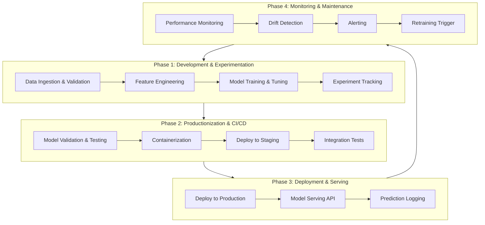

Here is a comprehensive and meticulously structured guide to Python for Advanced AI and Production Systems, designed to be as exhaustive as possible. It covers the core philosophy of MLOps, the end-to-end architecture, in-depth explanations of critical components with examples, a complete interview question bank, and common pitfalls in production environments.

# The Complete Guide to Advanced AI and Production Systems with Python: A Master Reference

This guide assumes you have mastered the fundamentals of data analysis and machine learning. It focuses on the engineering discipline required to take models from a Jupyter Notebook to a reliable, scalable, and maintainable production system.

---

## Part 1: The Core Philosophy & The Production Mindset

The shift from experimentation to production requires a fundamental change in thinking. The goal is no longer just achieving high accuracy on a test set, but delivering **reliable, scalable, and maintainable business value** over time.

### 1. The Three Pillars of Production AI

| Pillar | Core Question | Key Principles | Goal |
| :--- | :--- | :--- | :--- |
| **MLOps (Machine Learning Operations)** | How do we reliably build, deploy, and monitor ML systems? | Automation, versioning (code, data, model), CI/CD, reproducibility, testing . | To apply DevOps principles to the ML lifecycle, reducing technical debt and deployment friction. |
| **Scalability** | How does the system handle growth? | Horizontal scaling, distributed computing, efficient data access, asynchronous processing, load balancing. | To ensure performance and cost-effectiveness as data volume, request frequency, and model complexity increase. |
| **Reliability & Observability** | Is the system working correctly, and how do we know? | Monitoring (drift, performance, system metrics), logging, alerting, traceability, fallback mechanisms . | To maintain trust, quickly diagnose issues, and ensure the system behaves as expected in production. |

### 2. The End-to-End Production Workflow

This workflow extends the standard ML lifecycle with production-grade engineering practices .



---

## Part 2: The Advanced Production Stack - Components & Packages

This section details the key components of a production AI system and the Python packages used to build them.

### 1. The Core MLOps Framework: MLRun

MLRun is an open-source MLOps and orchestration framework designed to manage the entire ML lifecycle, from data to deployment, in a cohesive manner .

*   **Core Concept:** It abstracts away the underlying infrastructure (Kubernetes, etc.), allowing you to define and run your code as **functions** (data prep, training, serving) that are automatically logged, versioned, and scalable.
*   **Key Features:**
    *   **Project Management:** Organizes code, data, models, and jobs.
    *   **Function Hub:** Pre-built functions for common tasks (e.g., `hub://auto_trainer`).
    *   **Automatic Artifact Logging:** Automatically logs datasets, models, metrics, and parameters.
    *   **Real-Time Serving Pipeline:** Deploy models as scalable API endpoints with built-in model servers .

*   **Example: A Complete MLRun Workflow**
    ```python
    import mlrun
    # 1. Create or get a project
    project = mlrun.get_or_create_project(name="production-demo", user_project=True)

    # 2. Define and run a data preparation function
    project.set_function("data-prep.py", name="data-prep", kind="job", image="mlrun/mlrun")
    data_run = project.run_function("data-prep", local=True, returns=["dataset", "label_column"])

    # 3. Import and run a training function from the hub
    trainer = mlrun.import_function("hub://auto_trainer")
    train_run = project.run_function(
        trainer,
        inputs={"dataset": data_run.outputs["dataset"]},
        params={
            "model_class": "sklearn.ensemble.RandomForestClassifier",
            "label_columns": data_run.results["label_column"],
            "model_name": "prod_classifier",
        },
    )

    # 4. Create and deploy a serving function
    serving_fn = mlrun.new_function("serving", kind="serving")
    serving_fn.add_model("model_endpoint", model_path=train_run.outputs["model"])
    serving_fn.deploy()
    # 5. Test the deployed endpoint
    serving_fn.invoke("/v2/models/model_endpoint/infer", body={"inputs": [[5.1, 3.5, 1.4, 0.2]]})
    ```

### 2. Model Registry & Versioning: MLflow

While MLRun has its own registry, MLflow is a widely adopted, standalone tool for managing the model lifecycle .

*   **Core Concept:** A central repository for storing, annotating, and managing models with their versions, stages (Staging, Production, Archived), and signatures (input/output schema).
*   **Why it's crucial in production:**
    *   **Governance:** Provides an audit trail of which model version is in production.
    *   **Reproducibility:** Links a model to the run that produced it, including code version, data snapshot, and hyperparameters.
    *   **Deployment:** Enables smooth transitions between model stages.

### 3. Scalable Model Serving & APIs

Once a model is trained and registered, it needs to be served for inference.

*   **FastAPI:** The modern standard for building high-performance REST APIs in Python. It's used to wrap your model and expose it via HTTP endpoints .
    *   **Key Features:** Automatic OpenAPI docs, data validation with Pydantic, async support, and high speed.
    *   **Example: A Simple Model Serving API**
        ```python
        from fastapi import FastAPI
        from pydantic import BaseModel
        import joblib
        import numpy as np

        app = FastAPI()
        model = joblib.load("model.pkl") # Load your model

        class InputData(BaseModel):
            feature1: float
            feature2: float
            # ... define all features

        class Prediction(BaseModel):
            prediction: float

        @app.post("/predict", response_model=Prediction)
        async def predict(data: InputData):
            # Convert input to model's expected format (e.g., numpy array)
            input_array = np.array([[data.feature1, data.feature2]])
            prediction = model.predict(input_array)[0]
            return Prediction(prediction=prediction)

        # To run: uvicorn main:app --reload
        ```

*   **MLRun Serving:** As shown above, MLRun can automatically wrap your model in a high-performance, scalable serving container that includes built-in model servers (e.g., for scikit-learn, TensorFlow) and can handle pre/post-processing logic .

*   **ONNX (Open Neural Network Exchange):** An open standard format for representing machine learning models. It allows you to train a model in one framework (e.g., PyTorch) and run it for inference in another (e.g., .NET with TorchSharp, or with ONNX Runtime in Python) . This is critical for interoperability in polyglot production environments.

### 4. Model Monitoring & Observability

Deploying a model is not the end; it's the beginning of the monitoring phase.

*   **Concept: Drift Detection**
    *   **Data Drift:** The statistical properties of the input features have changed over time.
    *   **Concept Drift:** The relationship between the input features and the target variable has changed.
    *   **Tools:** MLRun's monitoring module, `whylogs` (for data logging and profiling), `evidently` (for generating drift reports).
    *   **Example (MLRun Monitoring):**
        ```python
        from mlops_production_system.monitoring import DriftDetector

        drift_detector = DriftDetector(reference_data="data/training_ref.parquet")
        drift_results = drift_detector.detect(new_data="data/production_batch.parquet")
        if drift_results.drift_detected:
            print(f"Drift detected in features: {drift_results.drifted_features}")
            # Trigger alert or automated retraining pipeline
        ```

*   **System Metrics:** Monitoring the health of the serving infrastructure. Tools like **Prometheus** (for metrics collection) and **Grafana** (for dashboards) are the industry standard . You would track:
    *   **Latency:** P95, P99 response times of your `/predict` endpoint.
    *   **Throughput:** Requests per second.
    *   **Error Rate:** 4xx and 5xx HTTP responses.
    *   **Resource Utilization:** CPU, memory, GPU usage of your model containers.

### 5. CI/CD for ML: GitHub Actions & Automation

Applying Continuous Integration and Continuous Deployment to ML projects is more complex due to the data and model components, but it's essential .

*   **CI (Continuous Integration):** Automatically test code, data validation rules, and model training scripts on every commit.
    *   **Linting/Type Checking:** Use tools like `ruff`, `mypy`, or the new Rust-based `ty` for blazing-fast checks .
    *   **Code Complexity:** Use tools like `complexipy` to prevent overly complex code from entering the codebase .
    *   **Model Tests:** Train a quick model on a sample of data to ensure the training pipeline runs without errors.
*   **CD (Continuous Deployment):** Automatically deploy validated models to staging or production environments.
    *   **Workflow Example (GitHub Actions):**
        1.  Data scientist pushes a new model training script.
        2.  GitHub Actions runs the CI pipeline (linting, unit tests).
        3.  On success, the pipeline triggers a model training job on a compute cluster (e.g., using MLRun).
        4.  If the new model's performance metrics exceed the current production model's metrics (according to registry), it is automatically registered and promoted to "Staging".
        5.  After manual approval or automated integration tests, the model is deployed to production via a GitOps-style update to Kubernetes manifests.

---

## Part 3: The "90% Job" Production Patterns

These are the architectural and design patterns you will use in almost every production AI system.

*   **The Feature Store Pattern:** Instead of having each training and serving pipeline recalculate features, centralize feature computation and storage in a **Feature Store**. This ensures **training-serving consistency** (the same features are used in both phases).
*   **The Model as a Microservice Pattern:** Encapsulate your model, its pre-processing logic, and its dependencies in a standalone container (e.g., Docker). This promotes loose coupling, independent scalability, and technology heterogeneity (you can have models served from different stacks).
*   **The Predictor-Transformer Pattern:** Separate the core model inference from data transformation. In a serving pipeline, you have a chain of "transformers" that pre-process the raw input (e.g., normalize, one-hot encode) before it's passed to the "predictor" (the model). This keeps the model itself clean and focused.
*   **The "Canary" Deployment Pattern:** When deploying a new model version, route a small percentage of live traffic (e.g., 5%) to it. Monitor its performance and error rates. If it's stable, gradually increase the traffic. If issues arise, roll back immediately, affecting only a small subset of users.
*   **The Fallback Strategy:** Your serving API should always have a fallback. If the model is slow to respond or fails, what do you return? A cached prediction from a previous request? A rule-based default? Having a fallback prevents total system failure.

---

## Part 4: Tricky Situations in Production & How to Handle Them

*   **Training-Serving Skew:** This is the cardinal sin of production ML. The model performs well in offline evaluation but poorly in production.
    *   **Cause:** Differences in how data is processed between training and serving (e.g., different feature engineering libraries, missing values handled differently, different data sources).
    *   **Solution:**
        1.  **Use a Feature Store:** Ensures features are computed identically.
        2.  **Package Pre-processing with the Model:** Include the `StandardScaler` object and any custom transformers inside the model artifact (using `sklearn.pipeline.Pipeline`) so the same transformations are applied at inference time.
        3.  **Log & Compare:** Log raw inputs and pre-processed features in production and compare their distributions to your training data.

*   **Slow Model Inference:** Your model is accurate but too slow to meet the service-level agreement (SLA).
    *   **Solution:**
        *   **Model Optimization:** Use frameworks like **ONNX Runtime** or **OpenVINO** to optimize the model for the target hardware.
        *   **Hardware Acceleration:** Serve the model on a GPU if it's a deep learning model.
        *   **Batching:** If you have many concurrent requests, batch them together on the server before passing them to the model (GPUs are particularly efficient at this).
        *   **Asynchronous Inference:** For non-real-time applications, use a message queue (like RabbitMQ or Kafka). The API accepts a request, puts it in a queue, and returns a `202 Accepted` with a URL to poll for the result later.

*   **Model "Staleness" and Silent Failures:** The model is serving predictions, but the world has changed, and its predictions are no longer accurate. This is a silent failure because your API still returns `200 OK`.
    *   **Solution:** This is why **model monitoring is non-negotiable** . You must track:
        *   **Prediction Distribution:** Are you predicting the same classes as before?
        *   **Feature Distributions:** Are `age`, `income`, etc., drifting?
        *   **Business Metrics:** Has the conversion rate for your recommendation model dropped? This is often the ultimate signal.

*   **Dependency Hell in Model Serving:** Different models require different (and sometimes conflicting) versions of Python packages.
    *   **Solution:** **Containerization (Docker) is the answer.** Each model microservice runs in its own container with its own isolated environment. Kubernetes then orchestrates these containers seamlessly.

---

## Part 5: The Advanced AI/Production Interview Question Bank

### MLOps & Architecture Questions

*   Q: What is MLOps and why is it different from DevOps?
    *   *A: MLOps extends DevOps principles to machine learning systems. The key difference is the addition of ML-specific components like data versioning, model versioning, experiment tracking, and the challenge of maintaining consistency between training and serving pipelines. An ML system has a CI/CD part (code) and a CT (Continuous Training) part (data & models) .*
*   Q: Explain the concept of "training-serving skew" and how to prevent it.
    *   *A: It's a divergence between how data is processed during model training and how it's processed during live inference, leading to poor production performance. Prevention strategies include using a Feature Store, packaging pre-processing logic with the model (e.g., in a scikit-learn Pipeline), and rigorous logging and comparison of feature distributions.*
*   Q: How would you design a system to serve thousands of predictions per second with low latency (<100ms)?
    *   *A: 1. Model Optimization (ONNX). 2. Deploy as a microservice with FastAPI. 3. Containerize with Docker. 4. Orchestrate with Kubernetes for horizontal auto-scaling. 5. Consider using a GPU if model is complex. 6. Implement efficient batching if request patterns allow. 7. Use a load balancer. 8. Cache frequent results with Redis.*
*   Q: What is the role of a Feature Store in a production ML system?
    *   *A: A Feature Store is a centralized repository for managing and serving features. It solves two main problems: 1) **Consistency** by ensuring the same feature logic is used for training and serving, and 2) **Reusability** by allowing different teams and models to share and discover pre-computed features, preventing redundant work.*

### Model Deployment & Serving Questions

*   Q: Compare batch prediction, real-time (online) prediction, and streaming prediction. When would you use each?
    *   *A: **Batch:** Process large volumes of data periodically (e.g., nightly recommendations). Good for non-time-sensitive tasks. **Real-time (Synchronous):** Predict on-demand with low latency (e.g., fraud detection on a credit card swipe). Model is exposed via an API. **Streaming (Asynchronous):** Process events as they arrive, often with stateful processing (e.g., real-time ad bidding on a clickstream). Uses technologies like Kafka and Flink.*
*   Q: How would you perform A/B testing on a new model in production?
    *   *A: Deploy both the current (control) and new (treatment) models simultaneously. Use a load balancer or feature flag to randomly assign a percentage of live traffic to the new model. Log all predictions and outcomes (e.g., user clicks, conversions). After the test period, perform a statistical analysis to determine if the new model's performance metric is significantly better.*
*   Q: You've deployed a model, and its accuracy on live data has started to drop. How do you debug this?
    *   *A: 1. **Check Infrastructure:** Are there any errors, latency spikes, or resource constraints? 2. **Check for Data Drift:** Compare the distribution of live input features to the training data distribution. 3. **Check for Concept Drift:** If possible, compare the relationship between features and ground truth (if labels are available with a delay). 4. **Check for Data Pipeline Issues:** Is the pre-processing code still running correctly? Are data sources still valid?*

### Scalability & Performance Questions

*   Q: How do you handle a scenario where your model inference is too slow for your real-time API requirements?
    *   *A: First, profile to find the bottleneck (pre-processing or model inference?). Then consider: 1) Model optimization/distillation. 2) Moving to more powerful hardware (GPU). 3) Implementing server-side batching. 4) Caching predictions for identical inputs. 5) As a last resort, if the requirement is truly real-time, a simpler, faster model might be necessary.*
*   Q: Explain the concept of "backpressure" in a prediction system and how to handle it.
    *   *A: Backpressure is a buildup of requests when a system receives traffic faster than it can process. This can lead to cascading failures. Handling strategies include: 1) **Load Shedding:** The API starts rejecting requests (returning `503 Service Unavailable`) when it's overloaded. 2) **Queuing:** Use an asynchronous architecture with a durable queue to buffer requests and process them at a manageable pace. 3) **Autoscaling:** Automatically spin up more instances of the prediction service.*

### Reliability & Observability Questions

*   Q: What metrics would you monitor for a machine learning model in production?
    *   *A: Three categories: 1) **Operational Metrics:** Latency, throughput, error rate, resource consumption (CPU/GPU/Memory). 2) **ML-Specific Metrics:** Data drift, concept drift, prediction distribution, feature importance. 3) **Business Metrics:** Conversion rate, churn rate, CTR, depending on the model's objective .*
*   Q: How would you implement a "rollback" for a deployed model?
    *   *A: With proper versioning and deployment patterns, this is straightforward. 1. **Model Registry:** Have the previous "Production" model artifact saved and versioned. 2. **Blue/Green Deployment:** Keep the previous environment ("blue") running while the new one ("green") is deployed. Switching back is just a matter of re-routing traffic to "blue". 3. **Kubernetes:** Update the deployment's image tag to the previous version and re-apply. The orchestrator will handle the rollback.*

By mastering these advanced concepts, tools, and patterns, you will be exceptionally well-prepared to design, build, and maintain robust, scalable, and reliable AI systems in production using Python.